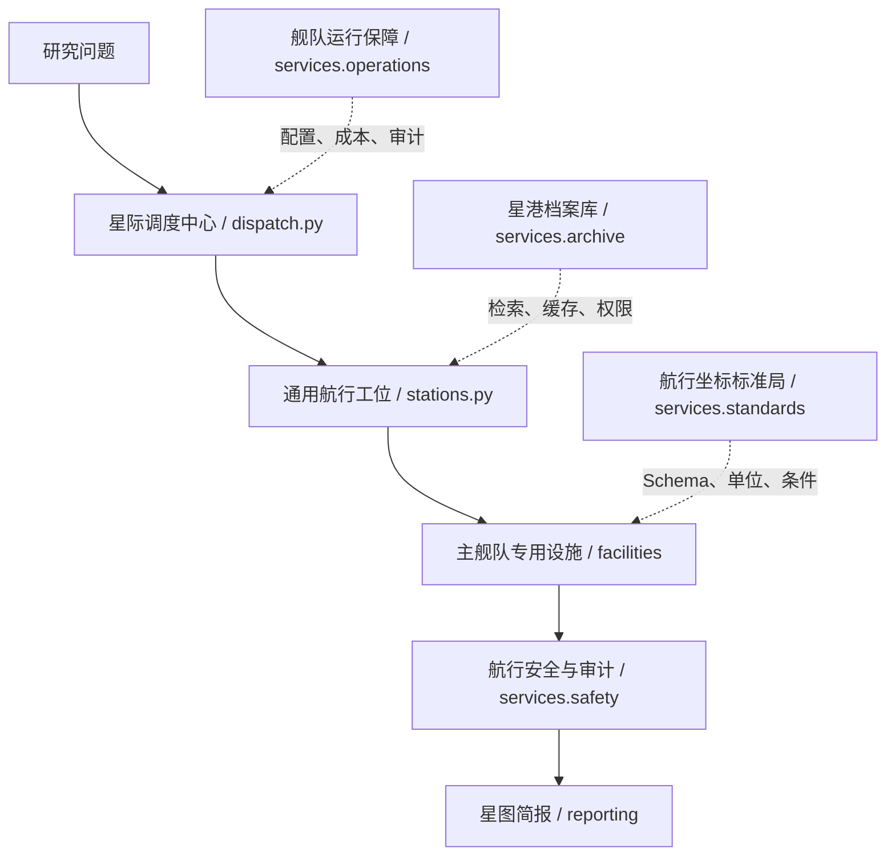

# CosMatter 项目结构与后续路线图

> 版本：v0.2（2026-08-31）
> 发布边界：本目录是唯一拟提交 GitHub 的 CosMatter 仓库；`01_Plan`、`02_Reference`、`03_Paper`、根目录 `.env` 和旧 `04_Agent` 均不属于发布内容。

## 1. 发布仓库的目录边界

```text
CosMatter/
├── README.md                     # 项目定位、快速开始、能力边界
├── pyproject.toml                # Python 包与 CLI：cosmatter
├── .env.example                  # 仅变量名和安全注释，不含真实密钥
├── .gitignore                    # 排除 .env、.venv、runs、缓存与构建产物
├── src/cosmatter/
│   ├── models.py                 # 当前：工件契约；后续：Fleet/Station/Facility Schema
│   ├── state_machine.py          # 当前：任务状态机；后续：舰队调度门禁
│   ├── config.py                 # 密钥状态检查与安全加载
│   ├── audit.py                  # JSONL 黑匣子与敏感字段脱敏
│   ├── sciverse.py               # Sciverse 检索适配器
│   ├── cli.py                    # 命令行入口
│   ├── dispatch.py               # 后续：星际调度中心
│   ├── stations.py               # 后续：通用航行工位
│   ├── facilities/               # 后续：各舰队专用仪器/设施
│   ├── services/                 # 后续：星港档案、标准、安全、运行保障
│   └── reporting/                # 后续：星图简报与机器可读附录
├── configs/fleets/               # 舰队—设施—门禁的可审查配置
├── tests/                        # 无密钥单测与冻结集测试
├── examples/                     # 仅开放示例；不得放入受限论文或密钥
├── web/                          # 无密钥 HTML 界面（任务舰桥与星图面板）
└── docs/
    ├── architecture/             # 架构、工件、设施与路线图
    ├── data-governance.md        # 来源许可、缓存与发布边界
    ├── evaluation.md             # 证据、条件、分歧和复现指标
    └── ../SECURITY.md            # 密钥、日志与事件响应边界
```

## 2. 从当前 M1.1 原型到舰队设施架构

| 阶段 | 新增结构 | 目标 | 验收证据 |
|---|---|---|---|
| S0：发布基线 | 独立包 `cosmatter`、测试、无密钥模板、Git 仓库 | 原型可在仓库外独立安装与运行 | `unittest` 全绿；`check-config` 不回显秘密 |
| S1：调度与配置 | `dispatch.py`、`FleetType`、`StationType`、`FacilityType`、`configs/fleets/*.yaml` | 一项任务唯一主舰队，且可解释分派原因 | 非法舰队交接与未核验发布的单测失败 |
| S2：证据巡检舰队 | `facilities/evidence.py`：原文定位镜、证据比对台、条件记录仪 | 产出具有页码/offset 的条件化 `EvidenceCard` | 接收卡 100% 具 `document_id + locator + quote` |
| S3：航道诊断舰队 | `facilities/diagnosis.py`：航迹叠加仪、条件差分舱、反证探测器 | 找到可解释与不可解释的文献分歧 | `DiscrepancyMatrix` 含条件签名与反例检索记录 |
| S4：发现与验证舰队 | `facilities/discovery.py`、`facilities/validation.py` | 输出有范围的 Gap 和可证伪验证方案 | 每个候选包含边界、替代解释、变量、对照与失败判据 |
| S5：HTML 界面、星图与评测 | `web/` 静态前端、`reporting/`、冻结案例、CLI/只读 JSON | 将通过门禁的工件渲染为可回链的任务舰桥、证据卡与星图报告 | 静态资源可加载；浏览器不含密钥；固定语料、模型和配置下可复跑关键结果 |

## 3. 运行时职责边界



每个设施必须实现下列约束：

```python
FacilitySpec(
    facility_id="condition_differential",
    fleet_type="route_diagnostics",
    input_types=("EvidenceCard", "ConditionProfile"),
    output_type="DiscrepancyMatrix",
    allowed_tools=("evidence_store", "condition_normalizer"),
    validation_rules=("citation_complete", "conditions_explicit"),
    max_attempts=2,
)
```

设施不能直接发布结论，也不允许绕过 `services.safety`。

## 3.1 UI / HTML 界面路线

第一版界面采用静态 HTML/CSS/JavaScript，不把 API Key、模型调用或受限全文带入浏览器。它只读取由 Python 导出的已脱敏 JSON，或由本地只读 HTTP 接口返回的已批准工件。

| 界面区域 | 首版显示 | 允许的数据 | 禁止显示 |
|---|---|---|---|
| 任务舰桥 | 问题、材料、性质、范围、主舰队及分派理由 | `MissionBrief`、`FleetAssignment` | `.env`、模型隐藏推理 |
| 航行面板 | 当前工位/设施、状态、重试次数、退回原因 | 脱敏状态事件、`VerificationDecision` | 请求头、完整工具日志 |
| 证据卡查看器 | 主张、条件、来源定位、审核结论 | 已批准 `EvidenceCard` 的短摘录 | 受限 PDF 与全文缓存 |
| 条件星图与分歧矩阵 | 条件簇、支持/反驳/未知、证据 ID | `DiscrepancyMatrix`、公开元数据 | 将图布局解释为因果关系 |
| 星图简报 | 已批准的结论、局限、下一步验证建议 | `MissionReport` | 未经核验的候选或草稿 |

接口顺序：先提供 `examples/ui-demo/*.json` 作为前端测试夹具；再增加 `cosmatter export-ui` 命令；最后才引入本地 HTTP API。详见仓库根目录 [TODO.md](../../TODO.md)。
## 4. GitHub 提交边界与发布检查

### 可提交

- 源码、测试、示例配置、无密钥 `.env.example`、文档和可复跑的演示输入；
- 自己编写的冻结测试问题、人工标注结构与统计结果；
- 仅包含必要元数据和短定位摘录的公开文献示例（遵守来源条款）。

### 严禁提交

- `.env`、API Token、浏览器导出凭据、运行日志中的请求头；
- `runs/`、缓存、虚拟环境、模型权重；
- `03_Paper` 中的本地论文、未经许可的 PDF/解析全文；
- 来自 Sciverse 或其他服务的受限正文、未获许可附件和完整 API 响应。

### 推送前检查

```powershell
python -m unittest discover -s tests -v
python -m cosmatter check-config
git status --short
git diff --check
git ls-files | Select-String -Pattern '(^|/)(\.env|runs|\.venv|03_Paper)(/|$)'
```

最后一条不应有输出。推送前仍须确认 GitHub 仓库可见性、第三方数据许可与资源披露；仓库代码与文档采用 MIT 许可证，但该许可证不授予第三方数据、全文或 API 内容的再分发权限。

## 5. 首个公开提交的建议内容

1. `v0.1.0`：M1.1 证据优先基础设施、Sciverse 适配器、状态机、审计与单测；
2. `v0.2.0`：舰队调度与“证据巡检 / 航道诊断”两支先导舰队；
3. `v0.3.0`：条件星图、冻结评测与 BiFeO3 的开放演示数据；
4. `v0.4.0`：隔离的计算验证设施（仅限批准任务）。

每一版本都需要记录模型、数据源、配置版本、已知局限和不支持的用法。
