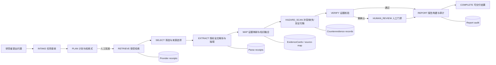
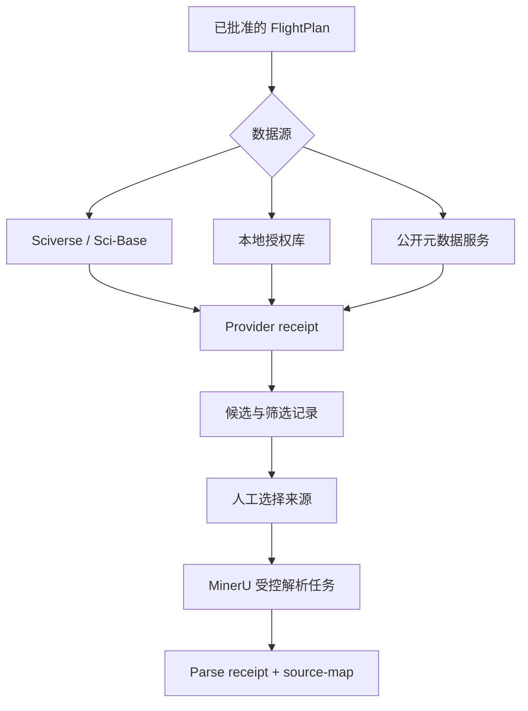

# CosMatter 现有 Agent 框架说明（可编辑稿）

> 本文描述当前仓库中已实现或已明确约束的 CosMatter 架构，供方案撰写、原型迭代和团队讨论使用。  
> 重要原则：CosMatter 不是让多个大模型自由讨论后直接给出结论；它是一个**由状态机约束的角色化工作流**。任何可写入结构化结论、Research Gap 或最终报告的内容，都必须能回到被授权的原始文献位置、处理记录和人工审核决定。

## 1. 系统定位

CosMatter 是面向材料科学文献调研的证据驱动智能体系统。当前以 BiFeO₃ 文献调研作为示范任务，但数据结构和工作流不绑定特定材料，后续可迁移到铁电、催化、能源材料、二维材料等体系。

它要处理的不是“回答一篇论文讲了什么”，而是一条可审计的调研链：

```text
研究问题
  → 任务拆解与检索计划
  → 受控检索、筛选与全文解析
  → 材料事实抽取和条件规范化
  → 跨文献融合、矛盾与缺失检测
  → 基于证据的 Gap 候选与反证检索
  → 人工核验
  → 带定位引用的调研报告
```

系统应当区分三类表述：

| 类型 | 含义 | 能否直接进入最终报告 |
|---|---|---|
| 文献事实 | 文献原文中可定位的成分、结构、性能、工艺、条件或模拟方法 | 可以，但需关联来源定位 |
| 跨文献推论 | 在多个已接受事实间，根据可解释规则得到的比较、聚合或冲突 | 可以，但必须显示参与文献、条件和推理规则 |
| 待验证假设 | 由缺失、冲突或变量组合启发的研究建议 | 不可伪装成事实；必须写明可证伪条件与验证方法 |

普通关键词搜索只返回文献条目；普通 RAG 常把片段拼成答案。CosMatter 的差异在于：它以**EvidenceCard（证据卡）**为基本可信单元，并把任务批准、外部调用回执、解析边界、人工选择、反证边界和报告审计一并保存。

## 2. 总体架构



从实现角度看，系统可分为六层：

1. **交互与任务层**：接收科学问题、研究对象、范围、可用数据源、输出要求与人工批准决定。
2. **编排与状态层**：以有限状态机限制任务只能按合法路径推进，防止模型自行跳过检索、解析或核验。
3. **角色化能力层**：以“舰队/设施”语义组织规划、检索、筛选、解析、融合、核验、报告等专门能力。
4. **证据与知识层**：以来源定位、EvidenceCard、材料事实、单位/条件规范化结果、关系边和 Gap 候选构成可追溯知识库。
5. **外部工具层**：以受限适配器调用 Sciverse、Sci-Base、本地文献库、MinerU、OpenAlex、Crossref 和可配置 LLM；调用均应记录摘要回执。
6. **呈现与审计层**：提供发现、工作流、文献图谱、论文阅读、研究拓展五个界面，并输出报告审计、运行清单和可复跑状态摘要。

## 3. “多 Agent”在 CosMatter 中的真实含义

当前的“Agent”更准确地说是**有固定输入输出边界的角色模块**。它们可调用不同的模型、规则程序或外部工具，但不共享无限制的自主权限。

| 角色 / 舰队设施 | 核心任务 | 主要输入 | 主要输出 | 不能自行决定的事 |
|---|---|---|---|---|
| 任务规划 Agent | 理解问题，拆分子任务、研究变量、检索范围和成功标准 | MissionBrief | FlightPlan 草案 | 直接执行未批准检索 |
| 文献检索 Agent | 依据批准检索式检索 Sciverse、Sci-Base 或本地授权库 | 已批准计划 | 候选条目、提供方回执 | 任意扩展查询或调用未知接口 |
| 文献筛选 Agent | 去重、按范围和证据价值排序，支持人工纳入/排除 | 候选条目、筛选规则 | 入选清单、筛选理由 | 宣称候选文献已被全文核验 |
| PDF 解析与知识抽取 Agent | 创建授权解析任务；从受权文本/片段形成事实草案 | 文件、解析回执、来源片段 | 解析记录、抽取草案 | 读取无授权全文；将草案当事实写入 |
| 规范化与融合 Agent | 统一材料实体、单位、条件字段；构建比较矩阵和关系 | 已接受事实 | 规范化记录、跨文献关系、冲突候选 | 忽略条件直接合并数值 |
| Research Gap Agent | 基于缺失、冲突、反例边界生成可审查的 Gap 候选 | 证据卡、冲突/缺失记录 | GapCandidate 草案 | 仅依模型想象宣布“研究空白” |
| 证据核验 Agent | 校验来源定位、事实覆盖、反证查询和报告引用 | EvidenceCard、回执、GapCandidate | 通过/退回/需人工审核结论 | 删除不利证据或绕过人工门禁 |
| 报告生成 Agent | 只使用已核验的结构化事实、推论和假设撰写报告 | 审核后工件 | 带引用报告、审计结果 | 引入没有证据卡支撑的新事实 |

“舰队”负责一类任务的策略与状态；“设施”负责较细的工具能力，例如来源定位器、证据比较器、条件差异分析器、反证检测器、盲点检测器、变量组合器和假设分诊器。这样的分层允许后续替换某个模型或 API，而不改变证据结构与审核规则。

## 4. 工作流状态机与人工门禁

仓库中的状态机以如下主路径控制运行：

```text
INTAKE
  → PLAN
  → RETRIEVE
  → SELECT
  → EXTRACT
  → MAP
  → HAZARD_SCAN
  → VERIFY
  → HUMAN_REVIEW（必要时）
  → REPORT
  → COMPLETE
```

允许的关键回退包括：

- 筛选后发现范围不充分时，可回到 PLAN 修订检索策略；
- 核验发现证据不足、来源不可定位或条件不可比时，可回到 PLAN 补检；
- 需要研究者判断材料口径、冲突解释或 Gap 价值时，进入 HUMAN_REVIEW；
- 任何未终结任务均可取消；规划循环次数也被限制，避免模型无限重试。

人工门禁至少应放在以下位置：

1. **计划批准**：检索计划未批准前，不执行受控外部检索。
2. **全文/来源选择**：只有研究者确认可使用的本地文献或授权来源，才进入解析和事实记录。
3. **事实入库**：LLM 或规则抽取的结果先是草案；需要来源定位、字段检查和人工接受后才成为材料事实。
4. **Gap 接受**：每一条 Gap 都要检查支撑文献、冲突或缺失、已执行的反证边界、可证伪假设和建议验证方法。
5. **报告发布**：报告中的数字、引用、Gap 和“覆盖率”由审计器检查后再由人确认。

## 5. 核心数据工件：为什么系统可审计

CosMatter 不依赖一段聊天记录保存结论，而是生成相互引用的类型化工件。每个运行一般位于 `runs/<run_id>/`，便于冻结输入、复查输出和局部重跑。

| 工件 | 作用 | 关键内容 |
|---|---|---|
| MissionBrief | 定义研究任务 | 问题、材料、范围、约束、数据源、输出偏好 |
| FlightPlan | 可批准的执行计划 | 子任务、检索式、站点/舰队分配、停止条件 |
| Provider receipt | 外部检索调用摘要 | 提供方、时间、请求摘要、返回规模、状态；不保存密钥或无边界响应 |
| Candidate / screening record | 候选文献与筛选过程 | DOI/文献标识、去重键、纳入排除理由、排序依据 |
| Parse receipt | 解析任务回执 | 被解析对象、授权边界、解析器状态、产物索引/哈希 |
| Source map | 原文定位映射 | 页码、段落、表格/图号、短摘录或哈希、与事实的链接 |
| EvidenceCard | 最小可信证据单元 | 声明、来源、定位、条件、置信说明、审核状态 |
| Material fact | 结构化材料事实 | 成分、结构/相、性能、工艺、实验条件、模拟方法等类别 |
| Normalization record | 标准化轨迹 | 原始值、原始单位、目标单位、转换规则、失败原因 |
| Relation / fusion record | 跨文献融合结果 | 可比较关系、冲突关系、缺失关系、适用条件 |
| Counterevidence record | 已执行反证边界 | 反向检索式、结果摘要、受理/排除理由、证据链接 |
| GapCandidate | 可审查研究缺口 | 问题、证据、缺失/冲突、新颖性、可操作性、可证伪假设、验证建议 |
| Report audit | 报告发布前审计 | 引用覆盖、来源定位、Gap 边界、未解决冲突和渲染检查 |

因此，报告里出现“某温度、某薄膜厚度、某制备方法下的性能差异”时，应该能够沿着：

```text
报告句子 → EvidenceCard → Source map → 原始文献位置
```

反查；出现“文献存在矛盾”时，则应能进一步看到哪些变量不同，而不是仅看到一个模型生成的总结。

## 6. 从文献到材料知识的处理逻辑

### 6.1 检索、去重和筛选

检索首先由问题拆解得到概念组，例如材料体系、形貌/样品形态、结构或相、目标性能、工艺条件和排除条件。计划批准后，检索设施才调用：

- Sciverse API / Sci-Base：用于赛事或受控来源中的检索与元数据发现；
- 本地文献库：后续可支持 Zotero 库、PDF 文件夹或 Markdown 语料；
- OpenAlex / Crossref：仅用于与已接受 DOI 绑定的公开元数据补充、引文或关系扩展。

去重优先使用规范 DOI；缺少 DOI 时，使用文献标识、标题等谨慎回退键。筛选记录不能只保留“相关/不相关”，还应说明“为什么纳入”“为什么排除”“全文是否可合法处理”。

### 6.2 授权全文解析

MinerU 相关模块的职责是建立**授权解析任务边界**，并追踪解析回执，而不是把任何 PDF 都交给解析器。解析前应确认：

- 文件来自团队有权使用的本地语料、公开许可来源或 API 返回的许可范围内内容；
- 只将完成任务必需的材料传出；
- 记录服务版本、数据出域规则、服务条款和解析失败状态；
- 解析结果只作为后续定位与抽取的输入，不能自动证明其中的每个句子均已核验。

### 6.3 材料事实抽取、实体规范化与条件对齐

材料事实按至少六类组织：

1. 成分与掺杂；
2. 晶体结构、相与取向；
3. 性能及测试定义；
4. 工艺和热处理；
5. 实验条件与样品几何；
6. 模拟方法与计算设置。

抽取后必须保留原始字符串，再进行实体规范化和单位统一。例如，厚度、温度、应变、电场、极化、介电常数、磁性和能量指标不能脱离测试条件直接比较。

条件规范化模块要显式记录以下差异：样品形态（块体/薄膜/纳米结构）、衬底与外延应变、取向、厚度、电极、制备路线、退火气氛、测量温度、频率/电场协议，以及实验或计算方法。缺少这些字段时，系统应标记“不可直接比较”，而非硬性合并。

## 7. 跨文献融合、冲突检测与 Research Gap

### 7.1 融合与冲突

融合层输出的是带条件的关系，而不是单一“材料真值”。可包括：

- 同一材料实体在不同命名、化学式或掺杂写法下的归一关系；
- 支持关系：多篇文献在可比较条件下得到相近结论；
- 矛盾关系：声称相反结论，且已定位造成差异的变量或未知变量；
- 缺失关系：关键变量、对照、测量协议或误差信息未被报告；
- 引文与主题关系：用于图谱导航，不等同于因果关系。

当前关系图谱适合解释“哪些论文、证据卡和变量彼此相关”。它不能仅凭边的数量推断科学结论。

### 7.2 Research Gap 的生成约束

Research Gap 模块可以提出候选，但不能自由编造。每条候选应至少包含：

| 必填部分 | 说明 |
|---|---|
| 问题描述 | 精确到材料、条件与待解决变量 |
| 支撑文献 | 关联的 EvidenceCard 与来源定位 |
| 缺失或冲突 | 哪个字段、变量组合或结论出现空白/不一致 |
| 反证边界 | 已实际执行的反向检索或反例核对范围及结果 |
| 新颖性与可操作性 | 不是“没人做过”的空泛描述，而是受当前证据约束的判断 |
| 可证伪假设 | 结果如何支持或推翻该候选 |
| 建议验证方法 | 进一步检索、实验、表征或模拟的可执行建议 |

只有具备证据边界和人工审核状态的 GapCandidate，才可以进入报告。尚无反证检索记录、关键条件缺失或来源定位不完整的候选，只能作为“待核对线索”。

## 8. LLM、规则程序、数据库与外部 API 的边界

### 8.1 LLM 的作用

已配置或拟配置的 LLM（团队当前意向为 DeepSeek 系列；运行时模型以本地配置为准）适合承担：

- 科学问题的初步拆解；
- 检索式、筛选理由、字段抽取和报告段落的草案生成；
- 对已选证据片段进行受约束的解释与结构化填充；
- 生成需由规则和人工复核的 GapCandidate 草案。

LLM 输出默认是**不可信草案**。它不能替代 DOI 去重、单位换算、来源定位、调用回执、反证执行或人工批准。

### 8.2 规则与数据库的作用

- **规则程序**：状态转移、字段校验、DOI 规范化、单位换算、条件可比性判断、审计覆盖率检查。
- **结构化存储**：当前以运行工件 JSON/JSONL 和本地数据结构为主，保证轻量可复现。
- **向量检索**：可作为语义召回的可插拔能力；具体 Embedding 服务商、模型与许可证尚未在当前运行框架中固定。
- **关系数据库/知识图谱**：当前有关系工件与前端图谱，尚未强制绑定 Qdrant Cloud、Supabase 或 Neo4j AuraDB；若未来采用，应把部署、权限、费用、备份和迁移写入配置与合规文档。
- **Reranker**：可用于候选重排，但不取代人工筛选和证据核验；服务商/模型同样应在冻结实验时确定。

### 8.3 受控服务调用



MCP 服务目前只暴露有限的任务工具，例如创建任务、生成计划草案、批准计划、执行批准后的检索，以及执行批准后的本地语料检索。该设计的目标是：外部客户端可以驱动标准流程，但不能借 MCP 直接获得任意命令执行权限。

密钥只应置于本地环境变量文件中；运行工件、前端导出、日志、截图和提交材料都不应包含 API key、受限全文、无必要的第三方完整响应或敏感缓存。

## 9. 前端的五个工作区

前端不是另一套计算逻辑，而是后端/本地工件的可视化与人工操作入口。当前有五个工作区：

| 工作区 | 主要任务 | 应展示的真实对象 | 不应暗示的能力 |
|---|---|---|---|
| 发现（Research Discovery） | 定义问题、范围、候选和任务状态 | MissionBrief、计划、候选概览、证据数量 | 未实际完成的自动发现 |
| 工作流（Research Workflow） | 查看状态机、站点和人工门禁 | timeline、station 状态、待批准项、审计状态 | “多 Agent 已自主执行”的幻觉 |
| 文献图谱（Graph Network） | 导航文献、主题簇、引用/证据关系 | 已接受文献、关系边、条件分组、EvidenceCard 链接 | 无来源支持的因果或相似性 |
| 论文阅读（Paper Reading） | 核对原始材料与定位证据 | Source map、页面/段落/表格定位、抽取事实 | 直接再分发受限全文 |
| 研究拓展（Research Expansion） | 审查 Gap、假设与验证路线 | GapCandidate、反证边界、审计覆盖、验证建议 | 把未核验假设呈现为结论 |

三套主题（`light`、`dark`、`eye`）共享相同的语义色和交互状态，仅调整明度与氛围。背景动效由本地脱敏状态投影而来，只表达任务进度、证据密度或审计完成度；缺失数据时回退为低亮度静态状态，不伪造实时执行。

## 10. 当前工程现状与验证边界

### 已具备或已编码的框架能力

- Python 3.11 及以上的项目结构、命令行入口和 Docker 化方向；
- 任务状态机、任务规划、角色/舰队配置、运行取消与状态摘要；
- 受控检索、本地语料入口、候选筛选、DOI 去重；
- 解析回执、来源映射、材料事实草案、条件与单位规范化；
- EvidenceCard、融合/关系工件、冲突与反证边界记录；
- Gap 候选、人工审核、报告审计、提交清单和本地 UI 导出；
- 限定能力的 MCP 工具接口；
- 五页面前端、文献关系图谱及三主题状态驱动背景。

### 尚不能写成“已有实验结论”的内容

- 尚未完成 90 篇 BiFeO₃ 文献的正式冻结评测；
- 尚未获得真实的检索 Precision、Recall@K、nDCG@K、抽取 F1、单位匹配准确率、专家 Gap 认可率或 API 成本数据；
- 尚未确定生产使用的 Embedding、Reranker、向量数据库、关系数据库或知识图谱服务；
- 尚未确认具体 MinerU API 服务版本、数据出域策略、配额与最终许可证；
- 尚未公开代码仓库，也不应把未发布仓库链接、受限全文或服务密钥写入公开材料。

因此，当前正确表述是“完成了可审计原型与初步可行性验证框架，正在以 90 篇 BiFeO₃ 文献进行冻结评测准备”，而不是“系统已经取得某项性能指标”。

## 11. 建议的初步评测设计

第一阶段可冻结约 90 篇 BiFeO₃ 文献作为示范语料。通过学校账号获取的全文仅限团队有权的本地核对，不对外再分发。后续系统可分别支持本地 Zotero/PDF 文献库搜索，以及依据 Sciverse API、Sci-Base 的受控检索。

建议比较以下基线：

1. 关键词检索；
2. 语义检索；
3. 混合检索（关键词 + 语义 + 重排）；
4. 普通 RAG；
5. 单 Agent 顺序流程；
6. CosMatter 的“状态机 + 角色化工作流 + 证据门禁”流程。

建议评测指标：

| 模块 | 指标 |
|---|---|
| 检索 | Precision、Recall、Recall@K、nDCG@K |
| 筛选 | 纳入/排除一致性、去重准确率 |
| 抽取 | 字段级 Precision、Recall、F1 |
| 数值规范化 | 数值与单位匹配准确率、条件字段完整率 |
| 证据链 | 引用与原文定位准确率、审计覆盖率 |
| Gap | 专家认可率、新颖性、可操作性、证据完整率、反证边界完整率 |
| 工程成本 | 端到端运行时间、人工审核时间、API 成本、失败与重试记录 |

评测时需记录语料版本、脚本/配置、运行日期、人工标注指南、金标准负责人、失败案例和费用。未完成这些记录前，不应公布比较结果。

## 12. 可由团队修改和冻结的决定

以下是框架刻意保留的可配置项。团队确定后，建议把决定写入 `MissionBrief`、`FlightPlan`、配置文件和实验记录，而不是只写在方案文字中。

1. **研究范围**：BiFeO₃ 的通用调研、外延薄膜相稳定性、掺杂调控、铁电/磁电性能，或其他具体子问题。
2. **语料规则**：90 篇文献的来源、年份、文献类型、去重策略、全文授权范围与冻结日期。
3. **模型服务**：LLM 的实际模型版本；Embedding 与 Reranker 的服务商、模型、费用、数据政策和许可证。
4. **存储方案**：是否采用本地 JSON/SQLite、PostgreSQL、Qdrant、Neo4j 等；若采用云服务，需要补充账号权限、额度、备份和数据出境说明。
5. **人工审核规范**：由谁批准计划、接受事实、裁决冲突、评审 Gap；双人标注或专家复核的规则。
6. **Gap 评分**：新颖性、证据完整性、可操作性、可证伪性各自的权重与最低门槛。
7. **开放计划**：拟在初赛结束前开源的代码、示例配置、脱敏样例和文档；拟采用 MIT 许可证，但受第三方数据和 API 条款限制。
8. **可扩展方向**：在文献调研 Agent 稳定后，再接入构效关系建模、模拟工作流或合成路线建议；这些不应混入当前已完成能力。

## 13. 推荐阅读顺序

- [端到端文献调研工作流](literature_research_workflow.zh-CN.md)：从一项研究任务如何落到可审计产物。
- [CosMatter 初学者工作流](workflows/cosmatter_beginner_workflow.zh-CN.md)：以更细步骤解释如何从问题开始操作。
- [授权文献结构化解析边界](architecture/04_授权文献结构化解析边界.md)：说明为什么全文解析必须遵守权限、回执和定位约束。
- [项目结构与后续路线图](architecture/00_项目结构与后续路线图.md)：代码与文档目录的总体说明。

---

## 一句话版本（可用于对外介绍）

CosMatter 是一个以状态机编排多角色工具、以 EvidenceCard 和来源定位约束结论、以人工门禁控制计划与 Research Gap 发布的材料科学文献调研智能体；它把模型生成限制在可核验的证据工作流之内，而不是将语言模型回答直接当作科学发现。