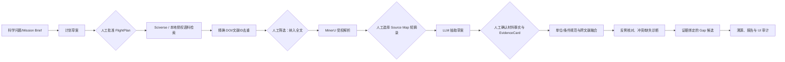

# CosMatter：材料科学文献调研 Agent 端到端工作流

## 1. 文档目的与适用边界

本文说明 CosMatter 如何把一个材料科学问题转化为**可审计、可复核、可复现**的文献调研过程。它面向赛事方向三的“文献调研 Agent”基本任务，以 BiFeO₃ 的相稳定性、铁电/磁性和薄膜制备条件差异作为示范对象；同一流程可替换为其他材料体系。

系统不把模型生成的段落当作科学事实。其最小可信单元是带有文献标识、定位信息、短摘录哈希、实验/模拟条件和人工复核状态的 `EvidenceCard`。系统输出严格区分三类内容：

| 类型 | 含义 | 是否可直接写入报告 |
| --- | --- | --- |
| 文献事实 | 经人工接受、能回到已审阅源图定位的 EvidenceCard 或结构化事实 | 可以，附文献定位 |
| 跨文献比较 | 在限定条件下对多个事实做的对齐、差异或不可比较判断 | 可以，须保留比较边界 |
| 待验证假设 | 由冲突、缺失连接或证据不足触发的 Research Gap 候选 | 可以作为“待人工审查的候选”，不可写成已验证结论 |

当前实现是一套受控工作流原型，不宣称已经完成 BiFeO₃ 90 篇真实语料的检索性能、抽取性能或专家认可率测试。90 篇样本及扩展材料体系的真实评测将在语料冻结和人工标注后进行。

## 2. 总体架构：舰队角色与可信边界

CosMatter 以“舰队协作”组织功能，但它不是让多个语言模型自由讨论后给出结论。每个角色有确定输入、产物和权限；关键跨越都需要人工批准或规则校验。

| 舰队角色/设施 | 对应能力 | 输入 | 受控产物 | 不能做的事 |
| --- | --- | --- | --- | --- |
| 导航指挥（任务规划） | 问题理解、子问题和检索式草案 | Mission Brief | `research_plan_draft.json` | 草案不能自行检索 |
| 航线批准门 | 人工限定检索范围 | 审阅后的计划 JSON | `flight_plan.json` | 不接受未审批的模型计划 |
| 深空监听（检索） | Sciverse 或本地语料的有界检索 | 已批准检索式及索引 | `retrieval_candidates.json` | 元数据候选不能直接成为证据 |
| 编目站（筛选与去重） | DOI/文献 ID 精确去重、人工纳入/排除 | 候选列表 | `candidate_screening.json` | 不做标题模糊合并或自动全文准入 |
| 解析舱（MinerU） | 对获授权、已筛选来源发起全文解析任务 | 文献 ID、显式 HTTPS 来源 | 解析任务回执 | 不把原始全文写入运行工件 |
| 档案定位台（source map） | 选择必要短摘录及页/段落定位 | 已完成解析任务、人工选段 | `source_map_*.json` | 未筛选文献不能建图 |
| 材料谱仪（抽取） | 成分、结构、性能、工艺、条件、模拟方法草案 | 已审阅短摘录 | `material_extraction_draft.json` | 草案不能直接进入报告 |
| 融合与诊断站 | 单位/条件规范、跨文献比较、关系图谱 | 审阅事实与 EvidenceCard | 融合结果、条件差异矩阵 | 不将不同条件强行视为矛盾 |
| 反证侦察与 Gap 舱 | 反例检索、条件冲突/缺失检测、Gap 候选 | 批准反例检索式、接受证据 | `research_gap_candidates.json` | 不允许 LLM 自由编造 Gap |
| 证据核验与报告舱 | 溯源审计、报告、UI 投影 | 接受的证据和审计结果 | `research_report.md`、`mission_report.json`、`ui.json` | 不暴露密钥、全文或原始服务响应 |



## 3. 运行前准备

### 2.1 当前实现状态与声明边界

下表区分“代码已实现的工件和门禁”与“尚未用 90 篇真实语料产生的性能结果”。这是防止工程演示被误读为科学验证的基本规则。

| 环节 | 当前已实现的受控能力 | 不应声明的事项 | 进入下一阶段的条件 |
| --- | --- | --- | --- |
| 计划与检索 | Mission Brief、人工批准 FlightPlan、主检索/反例检索历史 | 已证明任何检索方法优于基线 | 查询在已批准计划内且持久化运行记录 |
| 全文解析 | MinerU 任务、提供商回执、来源解析回执审计 | 已完成整个 90 篇解析或具有第三方服务质量保证 | 入选文献、任务、提供商回执和 Source Map 的哈希一致 |
| 知识抽取 | 六类材料事实模板、单位规范化、人工录入门禁 | 已得到真实抽取 Precision/Recall/F1 | 每条事实能匹配 Source Map 的段落、定位符和短摘录哈希 |
| 研究 Gap | 基于冲突/缺失的候选、已执行反例检索边界、人工评审入口 | 已发现新的材料规律或完成全面的新颖性检索 | 每条候选均含证据、条件差异、已执行反例检索历史哈希 |
| 报告与 UI | 结构化报告、脱敏 UI 投影、schema 1.3 证据审计 | 报告已经专家认可或研究假设已被实验证伪 | 报告审计、就绪度审计均通过，或明确保留 waiting_human_review/blocked 状态 |

因此，任何当前运行只能对它实际产生的工件负责。合成夹具用于测试这些门禁不退化，不是对真实语料的性能表述。


### 3.1 环境与密钥

在 `CosMatter/` 目录的专用 Python 环境中运行命令。项目根目录的真实 `.env` 只由本地运行时读取，不应被提交、复制到工件、粘贴进聊天记录或写入报告。可用 `../env.txt` 作为无密钥模板。

```powershell
cd CosMatter
.\.venv\Scripts\python.exe -m cosmatter check-config
```

`check-config` 只报告服务是否配置，不显示密钥。当前可按需配置的服务包括：DeepSeek（计划与抽取草案）、Sciverse（受控检索与上下文）、MinerU（授权全文解析）、OpenAlex/Crossref（公开元数据关系扩展）等。没有外部 API 时，任务规划以人工计划 JSON 进行，本地文献库/解析语料仍可完成离线基线。

### 3.2 语料与授权边界

初步评测拟冻结 90 篇 BiFeO₃ 文献。全文由学校已授权账号下载，仅限本地核对；不得再分发 PDF、原文段落集合、访问凭证或可定位到个人账号的下载记录。系统未来支持两种来源：

1. 用户显式提供的本地文献库，如 Zotero 元数据导出或已获授权的 PDF/Markdown 解析索引；
2. 经 API 调用的 Sciverse / Sci-Base 受控检索与上下文访问。

本地索引中允许保存文件路径和全文，仅供本地进程读取；运行目录 `runs/<run_id>/` 只保留无路径的元数据、哈希、定位符和审计摘要。

### 3.3 每次任务的身份

每次调研以 `run_id` 隔离，以 `mission_id` 绑定科学问题。建议把研究对象、目标性质和范围写得足够具体，避免“研究 BiFeO₃”这类不可操作的宽问题。

```powershell
.\.venv\Scripts\python.exe -m cosmatter create-mission `
  --question "Why do bounded thin-film studies disagree about phase stability?" `
  --material BiFeO3 --property "phase stability" --scope "epitaxial thin films" `
  --run-id bfo_001 --mission-id mission_bfo_001

.\.venv\Scripts\python.exe -m cosmatter assign-fleet `
  --question "Why do bounded thin-film studies disagree about phase stability?" `
  --material BiFeO3 --property "phase stability" --scope "epitaxial thin films" `
  --run-id bfo_001 --mission-id mission_bfo_001
```

产物 `mission_brief.json` 是全流程的范围锚点。后续证据、结构化事实、Gap 候选必须与其中材料和性质一致；跨任务材料混入会被报告和 UI 导出门禁拒绝。

## 4. 端到端工作流

### 步骤 1：问题拆解与检索计划

**输入：** Mission Brief，包括科学问题、材料、目标性质和研究范围。

**处理：** 如配置 DeepSeek，可生成不可信的 `research_plan_draft.json`，提出子问题、主检索式和反例检索式。此步骤仅用于辅助思考，模型草案不具备执行权限。人工应检查：研究对象是否准确、检索式是否覆盖制备条件/表征/模拟方法、反例是否能主动寻找相反结果，以及范围是否在样本和 API 配额内。

```powershell
.\.venv\Scripts\python.exe -m cosmatter draft-plan --run-id bfo_001
```

人工把审阅后的内容另存为 `reviewed_plan.json`，再显式批准：

```json
{
  "subquestions": [
    "Which epitaxial conditions differ between reported phases?"
  ],
  "queries": [
    "BiFeO3 epitaxial strain phase stability"
  ],
  "counter_queries": [
    "BiFeO3 epitaxial phase contradictory thickness substrate"
  ]
}
```

```powershell
.\.venv\Scripts\python.exe -m cosmatter approve-plan `
  --run-id bfo_001 --input .\reviewed_plan.json
```

**输出：** 有界 `flight_plan.json`。它限制子问题、主检索式、反例检索式、检索轮数与候选上限；所有后续计划检索只接受其中的索引，防止模型绕过审批扩大任务。

### 步骤 2：多源检索、精确去重与阅读路线

**输入：** 已批准 FlightPlan 中的查询索引；Sciverse 配置或本地授权语料索引。

**处理：**

- 外部检索：`execute-plan-query` 只执行批准的主检索或反例检索式，并保留服务来源和请求回执摘要；不保存原始 API 响应、摘要或全文。
- 本地检索：`execute-plan-local-corpus-query` 在显式授权的 Markdown 索引上做确定性本地检索（BM25 基线），索引路径与原文只在进程内存在。
- DOI 规范化后仅按**完全相同 DOI**或**完全相同文献 ID**合并候选，不做标题/年份的模糊合并。若多个来源指向同一 DOI，系统优先保留可访问内容路线，同时完整保留各来源和检索来源记录。

```powershell
# Sciverse：主检索与反例检索
.\.venv\Scripts\python.exe -m cosmatter execute-plan-query `
  --run-id bfo_001 --query-index 0
.\.venv\Scripts\python.exe -m cosmatter execute-plan-query `
  --run-id bfo_001 --query-index 0 --counter

# 本地授权 Markdown 语料：同样必须使用批准的查询
.\.venv\Scripts\python.exe -m cosmatter execute-plan-local-corpus-query `
  --run-id bfo_001 --index .\private_local_index.json --query-index 0
```

**输出：** `retrieval_candidates.json` 与检索历史。候选仍是“待筛选元数据”，不是事实证据。检索完成后可生成阅读路线，它只组织已检索候选与已有受审证据：

```powershell
.\.venv\Scripts\python.exe -m cosmatter build-reading-guide --run-id bfo_001
```

### 步骤 3：人工筛选与全文访问门禁

**输入：** 当前候选集合及其 DOI/来源/文献元数据。

**处理：** 先生成与当前候选指纹绑定的筛选模板，人工对每项填写纳入全文、排除或待定及理由。候选身份、去重结果或检索来源发生变化后，旧筛选记录会失效，必须重新审阅。

```powershell
.\.venv\Scripts\python.exe -m cosmatter create-candidate-screening-template `
  --run-id bfo_001
.\.venv\Scripts\python.exe -m cosmatter record-candidate-screening `
  --run-id bfo_001 --input .\reviewed_candidate_screening.json
```

**输出：** 完整的人工筛选工件。只有状态为 `include_for_fulltext` 且来源确有授权访问边界的文献，才能进入全文解析和 Source Map。元数据检索结果、本地 Zotero 搜索结果或人工手写文献 ID均不能绕过此门禁。

**受委托自动试点例外：** 当用户明确授权仅为跑通链路时，可使用 `record-automated-trial-screening --include-document-id <精确候选 ID>`，并在 `sciverse-read-context`、`mineru-submit-url` 和 `record-source-map` 上同时显式加 `--allow-delegated-automated-trial`。该路径将未选候选保留为 `needs_metadata_review`，工件一律标记为 `delegated_automated_trial_*_not_scientific_evidence`，与人工筛选文件分开存储；它**不能**进入正式材料事实、证据卡、融合、报告或提交包。

自动试点的 Source Map 只能由 `create-automated-trial-source-map-selection` 从私有 MinerU 候选池的精确 `segment_id` 构建；随后 `record-automated-trial-fact-audit` 可记录逐条的 `directly_supported`、`qualified_by_source` 或 `not_supported` 判断。该审核绑定 Source Map 摘录哈希，但不是人工审核，也不产生正式 `material_facts`。

**实现取舍：** 此处借鉴了 [Sciverse Frontier Lens 的数据支持审计](https://github.com/Shannon4Science/sciverse-frontier-lens/blob/main/docs/DATA_SUPPORT_AUDIT.md)：模型输出只能是绑定来源的派生工件，不能新增证据实体或关系；上游失败保留为有类型的失败，不以模型猜测补齐。CosMatter 未接入该项目的代码、图谱或本地明文配置；本项目仍以 `.env`、私有全文区和上述人工门禁为边界。

### 步骤 4：MinerU 解析与 Source Map 建立

**输入：** 已通过全文筛选的 `document_id`，以及由人工确认可用的 HTTPS 来源地址。

**处理：** MinerU 只接收一次显式授权的解析请求。系统记录任务 ID、状态和不泄露 URL 的回执关联；不把下载的解析输出或 PDF 写进运行工件。任务完成后，可显式用 `mineru-fetch-markdown` 将服务端结果中的唯一 Markdown 文件写到运行目录外、由使用者指定的新私有文件；ZIP 链接、ZIP 内容和 Markdown 都不会进入运行工件。随后人工在自己有权访问的解析结果中选择必要短摘录，填写段落/页码/章节定位并建立 Source Map。

```powershell
.\.venv\Scripts\python.exe -m cosmatter mineru-submit-url `
  --run-id bfo_001 --document-id <document_id> --source-url <authorized_https_url>
.\.venv\Scripts\python.exe -m cosmatter mineru-poll `
  --run-id bfo_001 --document-id <document_id>
.\.venv\Scripts\python.exe -m cosmatter mineru-fetch-markdown `
  --run-id bfo_001 --document-id <document_id> `
  --output D:\private-review\<document_id>.md
.\.venv\Scripts\python.exe -m cosmatter prepare-mineru-markdown-review `
  --run-id bfo_001 --document-id <document_id> `
  --input D:\private-review\<document_id>.md `
  --output D:\private-review\<document_id>_pool.json
.\.venv\Scripts\python.exe -m cosmatter audit-source-parse-receipts --run-id bfo_001
.\.venv\Scripts\python.exe -m cosmatter record-source-map `
  --run-id bfo_001 --document-id <document_id> --input .\reviewed_source_map.json
```

**输出：** 文献级 `source_map_<sha256>.json`。每一段只保留必要短摘录、`segment_id`、定位符和摘录 SHA-256；后续不依赖“模型说它看过全文”，而是强制回到这个定位图。未完成解析、未筛选或与文献 ID 不一致都会令该步骤失败。

**必须保留的解析回执链：** `mineru-submit-url`、`mineru-poll` 与（如使用）`mineru-fetch-markdown` 会将每个 `document_id` 的任务状态或 Markdown 哈希写入本次 run 的供应商回执清单。`audit-source-parse-receipts` 核对：(1) 任务对应的是已筛选的文献；(2) 任务及来源 URL 指纹未被替换；(3) 最终状态与当前 Source Map 合法。没有这个审计通过结果，解析阶段在 `workflow_readiness.json` 中将被标记为 `blocked`，而不是“已完成”。回执工件只保留安全标识、内容哈希与长度，不保存 PDF、原始 Markdown 或服务响应正文。


### 步骤 5：材料事实抽取、实体规范与人工确认

**输入：** 已审阅的 Source Map 短摘录。

**处理：** `draft-material-extraction` 可调用 DeepSeek，但只发送已选短摘录，生成不可信的材料事实草案。人工核对原文后，以 `segment_id` 为引用锚点录入正式事实。允许的事实类别为：

1. `composition`：成分、掺杂、化学计量；
2. `structure`：晶体结构、相、取向或畴结构；
3. `property`：铁电、磁性、介电、输运等性质及数值；
4. `processing`：制备工艺与处理；
5. `experimental_condition`：衬底、应变、膜厚、温度、气氛、测试条件等；
6. `simulation_method`：DFT、相场、分子动力学等方法与关键设置。

```powershell
.\.venv\Scripts\python.exe -m cosmatter draft-material-extraction `
  --run-id bfo_001 --document-id <document_id>
.\.venv\Scripts\python.exe -m cosmatter create-material-fact-review-template `
  --run-id bfo_001 --document-id <document_id>
.\.venv\Scripts\python.exe -m cosmatter record-material-facts `
  --run-id bfo_001 --document-id <document_id> `
  --input .\reviewed_material_facts.json
```

审核模板不复制短摘录原文，只列出可选类别、segment_id、定位符和摘录哈希，并与当前 Source Map 指纹绑定。审核人填写事实后，将 trust_status 改为 human_reviewed_material_facts_for_recording；若段落、定位或指纹被替换，record-material-facts 会拒绝写入。每条正式事实保留“原始值/单位、规范化值/单位、条件限定、源定位、短摘录哈希”。`record-condition-normalization` 只接受人工确认的条件名称与单位映射；它不在缺乏规则和审查时擅自换算或抹平条件差别。

```powershell
.\.venv\Scripts\python.exe -m cosmatter record-condition-normalization `
  --run-id bfo_001 --input .\reviewed_condition_normalization.json
```

**输出：** 文献级的 `material_facts_*.json` 与条件规范化工件。任何事实的文献 ID、段落 ID、定位符或摘录哈希若无法与当前 Source Map 精确对应，则后续融合、报告和 UI 导出都会停止。

### 步骤 6：EvidenceCard 与证据链核验

**输入：** 一条窄格式证据草案：主张、支持/反驳立场、材料、性质、条件、文献 ID、短摘录、定位符和 `evidence_id`。

**处理：** `ingest-evidence` 不负责“相信 LLM”；它只把满足以下条件的草案转为 EvidenceCard：

- 对应候选有当前、完整的人工 `include_for_fulltext` 决定；
- 文献已建立同一 `document_id` 的 Source Map；
- 草案中的短摘录和定位符与某个 Source Map 段精确匹配；
- 证据材料和性质与 Mission Brief 范围相符；
- 人工验证决定为接受状态后，才允许进入事实报告。

```powershell
.\.venv\Scripts\python.exe -m cosmatter ingest-evidence `
  --run-id bfo_001 --input .\evidence_draft.json
.\.venv\Scripts\python.exe -m cosmatter audit-evidence-provenance `
  --run-id bfo_001
```

**输出：** EvidenceCard、验证决定和不可变审计事件。该链保证“可追溯到已审阅片段”，但不替代领域专家对实验质量、统计显著性或科学真伪的判断。

### 步骤 7：跨文献融合、关系图谱与条件差异诊断

**输入：** 来自多个文献、已审阅的结构化材料事实和接受 EvidenceCard。

**处理：**

- `fuse-material-facts` 按事实类别、规范字段和规范单位分组。只有限定条件一致时，数值/结论差异才标记为待分析的不一致；若衬底、膜厚、温度、处理历史或方法不同，则明确标为“因条件不同而不可直接比较”。
- `diagnose-conditions` 构建条件差异矩阵，列出支持与反驳主张对应的证据、差异字段和缺失字段。
- `record-paper-structure` 可在 Source Map 约束下记录论文内实体与关系；OpenAlex/Crossref 扩展仅针对已有接受证据且带 DOI 的公开元数据。跨源身份映射必须由 `reconcile-relations` 人工确认，系统不会自动猜测两个近似标题是否同一文献。

```powershell
.\.venv\Scripts\python.exe -m cosmatter fuse-material-facts --run-id bfo_001
.\.venv\Scripts\python.exe -m cosmatter diagnose-conditions --run-id bfo_001
.\.venv\Scripts\python.exe -m cosmatter record-paper-structure `
  --run-id bfo_001 --input .\reviewed_paper_structure.json
```

**输出：** 融合结果、条件差异矩阵和可投影到文献图谱页面的关系数据。图谱用于导航“论文—实体—条件—证据—Gap”的关系，不代表系统已自动证明因果关系。

### 步骤 8：反例检索、Research Gap 候选与人工专家审查

**输入：** 已批准的反例检索式、同一 Mission Brief 内至少两条接受 EvidenceCard，以及条件差异矩阵。

**处理：** 系统先要求通过批准计划执行反例检索，避免只收集支持原假设的文献。之后只有在存在显式条件冲突或明确证据缺失连接时，`generate-gap-candidates` 才会生成候选；没有足够冲突时命令应失败，而不是编造研究方向。

```powershell
.\.venv\Scripts\python.exe -m cosmatter generate-gap-candidates --run-id bfo_001
.\.venv\Scripts\python.exe -m cosmatter create-gap-review-template --run-id bfo_001
.\.venv\Scripts\python.exe -m cosmatter evaluate-human-gaps `
  --run-id bfo_001 --input .\reviewed_gap_assessment.json
```

每条 Gap 候选至少包含：问题描述、支持 EvidenceCard ID、冲突字段或缺失连接、证据不足说明、新颖性与可操作性的人工评分入口、可证伪假设和建议验证方法。专家评审还必须确认已检查该候选对应的已执行反例检索，并将其有界新颖性检索结果标为“有界检索未见直接匹配”“发现相关既有工作”或“尚无定论”。前一种结果只描述当前冻结检索边界，绝不等同于“全球范围内没有人做过”。可选的 `draft-gap-hypotheses` 只能生成内部草稿；它不能进入报告或 UI 的科学结论区。

**输出：** `research_gap_candidates.json`。其状态固定为 `candidate_requires_human_review`，无论显示在 UI 还是写入报告，都必须标为待验证候选。

**新增的“已执行反例”门禁：** Gap 工件的 schema 1.1 不只记录计划中有没有 `counter_queries`。它还要求每一条已批准反例检索在检索历史中真实执行，并保存“计划反例查询数、已执行数、检索次数、候选 document_id 历史 SHA-256”。如果边界不完整、历史不匹配或任何已批准反例查询未执行，`write_gap_candidates` 会拒绝持久化候选。

这个边界不声明“已穷尽全世界文献”。它只说明：当前已冻结的 FlightPlan 中规定的反例查询确实被执行过，因而审查者可以复核“当前检索边界内未见直接匹配”这一有限结论。


### 步骤 9：报告、UI 投影与最终审计

**输入：** 接受 EvidenceCard、审阅事实、融合/诊断产物和合格的 Gap 候选。

**处理：** 报告生成前会重新检查来源映射和接受证据链；生成后再审计报告清单、Gap 证据 ID 和结构化报告覆盖情况。UI 只导出经过脱敏的 `ui.json`，不会启动新检索、新模型调用或把全文推送到浏览器。

```powershell
.\.venv\Scripts\python.exe -m cosmatter build-report --run-id bfo_001
.\.venv\Scripts\python.exe -m cosmatter audit-report-evidence --run-id bfo_001
.\.venv\Scripts\python.exe -m cosmatter export-ui --run-id bfo_001
.\.venv\Scripts\python.exe -m cosmatter audit-workflow-readiness --run-id bfo_001
```

**输出：**

- `research_report.md`：带 EvidenceCard ID、定位符、条件和比较边界的结构化调研报告；
- `mission_report.json`：用于程序消费的报告清单；
- `ui.json`：浏览器安全投影，可用于发现、工作流、文献图谱、阅读和研究拓展页面；
- `workflow_readiness.json`：按计划、检索、筛选、解析、抽取、Gap、报告和评测阶段报告状态。

`workflow_readiness` 的 `waiting_human_review` 表示尚未完成需要的人工审查，`blocked` 表示工件错误、过期或跨任务混入。两者都不是“系统已经完成”的同义词。

报告审计使用 schema 1.3 的 `report_evidence_audit.json`。除了逐条检查 EvidenceCard 和 Source Map 的引用，还必须计数并呈现 Gap 的反例边界，包括 `executed_gap_counterevidence_boundary_count` 和 `gap_counterevidence_boundary_rendered_coverage`。后者不为 100% 时，报告就不允许说明某个 Gap 已经进行反证核对。就绪度审计还会单独给出 `parse_receipt_link_valid`、`gap_artifact_valid` 和 `executed_counterevidence_boundary_count`，让 UI 和调研者看到阻断原因，而非仅看到一个「已完成」按钮。


## 5. 数据工件、保密与可追溯性

| 工件 | 主要内容 | 是否含全文/原始 API 响应 | 作用 |
| --- | --- | --- | --- |
| `mission_brief.json` | 问题、材料、性质、范围 | 否 | 任务范围锚点 |
| `flight_plan.json` | 人工批准的子问题与检索式 | 否 | 检索权限边界 |
| `retrieval_candidates.json` | 元数据、DOI、来源回执关联、去重信息 | 否 | 待筛选候选池 |
| `candidate_screening.json` | 完整人工纳入/排除决定 | 否 | 全文解析门禁 |
| `source_map_*.json` | 必要短摘录、定位符、哈希、段落 ID | 仅必要短摘录 | 证据定位基座 |
| `material_facts_*.json` | 经审阅的材料事实及其定位哈希 | 否 | 融合、图谱与报告输入 |
| `research_gap_candidates.json` | 证据 ID、冲突/缺失、假设、验证建议 | 否 | 待审查研究机会 |
| `research_report.md` / `ui.json` | 受门禁限制的报告和脱敏投影 | 否 | 人工阅读与 UI 展示 |

所有运行工件应位于本地 `runs/` 且被 Git 忽略。不得提交 `.env`、令牌、学校账号凭证、受限全文、PDF、原始解析输出、完整 API 响应、浏览器会话信息或未审阅的模型草案。

## 6. 90 篇 BiFeO₃ 初步评测工作流

真实评测不能从空白模板推出性能数值。建议按下列顺序完成：

1. 人工核对 90 个唯一 `document_id` 的书目信息、学校授权边界和 DOI 规范形式，生成无路径语料清单；冻结前必须拒绝规范化后 DOI 重复的记录，不以标题相似度代替这一判断；
2. 用 `record-corpus-manifest` 冻结评测集合，再用 `seed-authorized-corpus-candidates` 使其成为本地候选，但不把该动作称为检索排序结果；
3. 从获授权的本地 Markdown 解析结果制作私有索引；索引中的路径和全文仅本机可见；
4. 生成金标准模板，由独立人工标注检索相关性、证据定位、材料事实、条件可比性和 Gap 证据完整性；
5. 运行本地 BM25、Sciverse 检索（如允许）、关键词检索、语义/混合检索等对照，并冻结各自候选集合；
6. 在完整人工金标准后，计算并报告指标与失败案例，不以合成测试替代真实结果。

```powershell
.\.venv\Scripts\python.exe -m cosmatter record-corpus-manifest `
  --run-id bfo_eval_001 --input .\reviewed_bfo90_manifest.json
.\.venv\Scripts\python.exe -m cosmatter seed-authorized-corpus-candidates `
  --run-id bfo_eval_001
.\.venv\Scripts\python.exe -m cosmatter create-gold-standard-template `
  --run-id bfo_eval_001
```

建议的真实评测指标如下。所有指标都应同时记录语料版本、标注日期、评测者、模型/提示版本、检索候选宇宙、运行日期、成本和失败案例。

| 模块 | 指标 | 解释 |
| --- | --- | --- |
| 检索 | Precision@K、Recall@K、nDCG@K | 比较关键词、BM25、语义/混合检索与受控 API 路线 |
| 事实抽取 | Precision、Recall、F1 | 基于独立人工金标准，评估端到端审阅门禁后的结果 |
| 数值与单位 | 单位匹配准确率 | 只在同一文献、类别、字段、数值和定位均对齐时统计 |
| 证据链 | 引用/定位准确率、条件完整率、矛盾标签准确率 | 衡量是否能回到短摘录和条件字段 |
| Research Gap | 专家认可率、新颖性、可操作性、证据完整率 | 只评估证据绑定的候选，非模型自由文本 |
| 系统代价 | 报告时间、人工复核时间、API 成本 | 必须基于真实运行日志，不估填 |

仓库中的合成冻结夹具只用于回归测试代码逻辑；其输出不是 90 篇真实语料的实验结果。

## 7. 常见失败与处理原则

| 失败或风险 | 系统行为 | 正确处理 |
| --- | --- | --- |
| 未批准计划就调用检索 | 拒绝执行 | 先人工审阅并批准 FlightPlan |
| 候选仅有元数据或 Zotero 记录 | 不允许成为 EvidenceCard | 获得授权全文、完成人工筛选与 Source Map |
| DOI 相同但标题略不同 | 只按 DOI 精确合并 | 人工检查书目信息，不采用标题模糊匹配 |
| 筛选记录过期 | 拒绝 Source Map/证据录入 | 用当前候选集合重新生成模板并审阅 |
| Source Map 与证据摘录/定位不符 | 拒绝录入、报告和 UI 导出 | 回到获授权原文重新选段与复核 |
| 条件不同的两篇论文结论相反 | 标为不可直接比较或条件差异 | 补充字段、寻找反例与验证设计，不能直接宣称科学矛盾 |
| 缺少冲突或缺失连接 | 拒绝生成 Gap 候选 | 报告证据不足，而非编造研究空白 |
| 人工评价尚未完成 | readiness 标记 `waiting_human_review` | 完成独立标注后再报告真实指标 |

## 8. 复现、测试与交付检查

本地修改后，先运行离线测试和静态编译；它们不调用第三方服务：

```powershell
$env:PYTHONPATH = "src"
.\.venv\Scripts\python.exe -m unittest discover -s tests -q
.\.venv\Scripts\python.exe -m compileall -q src
```

建议每次外部调用前后保存：批准计划的版本、无密钥配置摘要、候选/筛选工件版本、人工审阅日期、服务调用时间、失败响应类别及成本汇总。代码计划在初赛结束前以 MIT 许可证公开；公开仓库不包含受限文献、密钥、运行缓存和第三方敏感响应。最终提交或展示前，团队应逐条核验报告中的科学事实、真实进度、数据授权、第三方服务条款及赛事材料要求。

## 9. 推荐的最小闭环

对于一次 BiFeO₃ 问题调研，最小但完整的可信闭环是：

1. 创建 Mission Brief，人工批准 FlightPlan；
2. 用一条主检索与一条反例检索获得候选，并完成所有候选的人工筛选；
3. 选择至少两篇已授权全文，建立 MinerU 任务与 Source Map；
4. 人工确认若干包含条件字段的 EvidenceCard 与材料事实；
5. 执行条件差异诊断；若证据满足条件才生成 Gap 候选；
6. 审计证据链、生成报告和 UI 投影；
7. 将任务状态保留为“需要人工复核”，直至完成独立评测和专家审查。

这个闭环的目标不是“自动写出一个看似合理的结论”，而是让每个可见结论、比较和研究建议都能返回到明确的文献证据、条件边界与人工决策。
