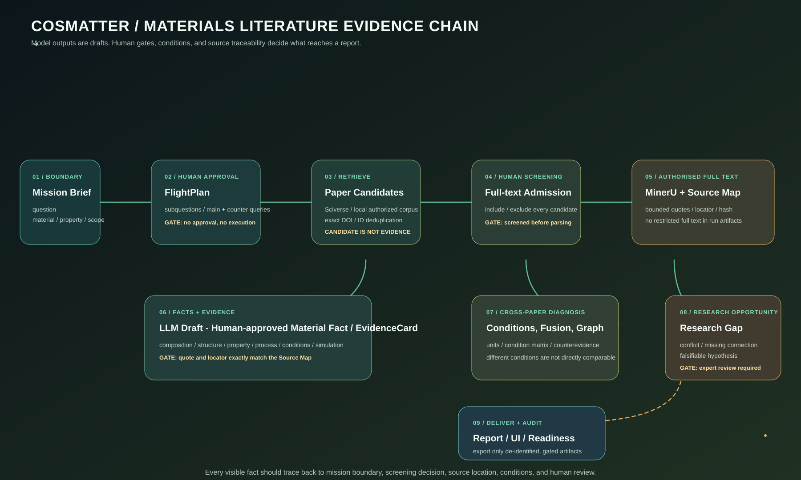
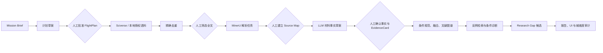

# CosMatter 初学者工作流：把材料文献调研变成可审计的证据链



> 适用对象：第一次构建材料科学文献 Agent、需要理解多角色工作流、全文解析、材料事实抽取、文献图谱和 Research Gap 的研究者。
>
> 本文说明 CosMatter 当前代码与文档定义的受控工作流。它以 BiFeO₃ 为示范对象，但不声称已经得出该体系的新科学结论，也不把未完成的 90 篇真实评测写成性能结果。

## 1. 先用一句话理解 CosMatter

CosMatter 是一个面向材料科学文献调研的本地工作流系统。它的目标不是让大模型“看起来像读过很多论文”，而是让每一个将被报告、显示或用于 Research Gap 的信息都能回答四个问题：

1. **来自哪篇文献？**
2. **来自文献的什么位置？**
3. **是在什么成分、结构、工艺、实验或模拟条件下得到的？**
4. **谁在何时审阅并允许它进入下一步？**

因此，CosMatter 的主线是：

```text
科学问题
  → 人工批准的检索计划
  → 多源候选文献
  → 人工筛选与授权全文
  → MinerU 解析 + Source Map
  → LLM 抽取草案 + 人工确认材料事实
  → EvidenceCard 证据链
  → 条件对齐、融合、反例与差异诊断
  → 有证据边界的 Research Gap 候选
  → 审计后的报告、图谱与 UI
```

## 2. CosMatter 要解决的真实困难

材料文献中的“矛盾”常常不是谁对谁错，而是下列条件有差异：成分、掺杂量、晶相、衬底、应变、膜厚、退火历史、测试温度、测试频率、表征方法、计算近似或模拟边界条件。普通搜索或普通 RAG 往往只把相似句子拼在一起，遗漏这些限定条件。

CosMatter 因此做了三层区分：

| 信息层 | 含义 | 示例 |
| --- | --- | --- |
| 文献事实 | 有原文短摘录、定位和人工接受状态的内容 | “文献 A 在某衬底/膜厚条件下报告某相” |
| 跨文献比较 | 将多个事实放到相同或不同的条件边界下比较 | “A 与 B 的温度不同，不能直接比较” |
| 待验证假设 | 从显式冲突或缺失连接得到的研究机会 | “需要在固定膜厚下测试应变对相稳定性的影响” |

第三层不是结论。它只能作为 `candidate_requires_human_review` 的 Research Gap 候选，必须带着支撑证据、证据不足处、可证伪假设和验证建议。

## 3. 初学者需要认识的核心对象

| 名称 | 简单解释 | 为什么需要它 |
| --- | --- | --- |
| Mission Brief | 一次调研任务的身份证：问题、材料、性质、范围 | 防止不同材料/问题的证据混在一起 |
| FlightPlan | 人工批准后的子问题、主检索式和反例检索式 | 防止模型任意扩展检索范围 |
| PaperCandidate | 通过 API 或本地语料得到的候选文献元数据 | 候选还不是证据 |
| Candidate Screening | 对每一个候选的人工纳入/排除决定 | 只有批准全文的文献可进入解析 |
| Source Map | 经人工选择的必要短摘录、段落 ID、定位符和哈希 | 让后续事实可精确回到来源 |
| Material Fact | 成分、结构、性能、工艺、条件或模拟方法的一条结构化事实 | 让跨论文比较有固定字段 |
| EvidenceCard | 一条可引用的证据主张，带文献、定位、条件和状态 | 报告与图谱的最小可信单元 |
| Condition Matrix | 支持/反驳证据之间的条件字段差异表 | 区分真正冲突和不可比较 |
| Research Gap Candidate | 由证据冲突/缺失触发的待审查研究建议 | 防止自由生成“空白” |


### 3.1 三个不能被跳过的审计门

新手可以把 CosMatter 理解为一个有“登机检查”的科研舰。所有输出都会经过下列三道门：

1. **解析回执门**：全文解析前先完成人工入选；后续还要用 `audit-source-parse-receipts` 证明 MinerU 任务、文献、来源指纹和 Source Map 没有脱节。
2. **证据定位门**：事实和 EvidenceCard 必须精确回到 Source Map 的 `segment_id`、定位符和短摘录哈希。模型说“我读过这篇论文”不算证据。
3. **反证执行门**：计划中的反例检索不能只写在 JSON 里。每条都要在检索历史中留下已执行记录；否则 Research Gap 候选不能被写入工件或报告。

三个门中任何一个失败，`workflow_readiness.json` 都应显示 `blocked` 或 `waiting_human_review`，而不应把运行渲染为完成的科学调研。

## 4. 舰队式多角色架构，但不是“放任多 Agent 聊天”

CosMatter 采用星际导航的角色命名，目的是让初学者理解职责分离。每个角色都由特定代码、文件工件和门禁约束；它不是多个模型各自猜测再投票。

| 角色/设施 | 做什么 | 输入 | 输出 | 人工门禁 |
| --- | --- | --- | --- | --- |
| 导航指挥 | 把科学问题拆成子问题与检索草案 | Mission Brief | 计划草案 | 必须批准 FlightPlan |
| 深空监听 | 检索 Sciverse 或本地授权语料 | 批准的查询索引 | 候选文献元数据 | 查询不可越出计划 |
| 编目站 | DOI/文献 ID 去重、纳排筛选 | 候选池 | 筛选工件 | 必须逐项人工完整筛选 |
| 解析舱 | 对获授权全文发起 MinerU 解析任务 | 文献 ID、授权来源 | 解析任务回执 | 必须先筛选纳入全文 |
| 档案定位台 | 从解析结果选择必要片段 | 已完成任务 | Source Map | 人工核对短摘录和定位 |
| 材料谱仪 | 从片段生成材料事实草案 | Source Map | 抽取草案 | 草案不能直接进入报告 |
| 融合诊断站 | 单位/条件规范化、跨文献比较 | 审阅事实和证据 | 融合结果、条件矩阵 | 条件不同必须标注边界 |
| 反证侦察舱 | 寻找反例、生成 Gap 候选 | 批准反例检索、接受证据 | Gap 候选 | 需显式冲突/缺失和专家审查 |
| 报告与舰桥 | 溯源审计、报告、UI/图谱投影 | 通过门禁的工件 | Markdown/JSON/UI | 每次导出重做关键校验 |



## 5. 完整工作流，逐步说明

### 步骤 0：配置环境，不泄露密钥

CosMatter 在 `CosMatter/` 的 Python 虚拟环境中运行。真实 `.env` 只在本机上层项目目录保存，绝不读取、编辑、提交或复制到运行工件。`env.txt` 是可公开的无密钥模板。

```powershell
cd CosMatter
.\.venv\Scripts\python.exe -m cosmatter check-config
```

这个命令只显示服务是否已配置，不显示密钥。当前工作流可按需接入：DeepSeek（计划/抽取草案）、Sciverse（受控检索/上下文）、MinerU（授权全文解析）、OpenAlex/Crossref（公开元数据关系扩展）。即使外部 API 未配置，本地语料、人工计划和离线测试也能运行。

### 步骤 1：创建 Mission Brief，写清问题边界

**输入：** 科学问题、材料、性质和范围。

示范问题不写成“研究 BiFeO₃”，而写成：

> Why do bounded thin-film studies disagree about phase stability?

```powershell
.\.venv\Scripts\python.exe -m cosmatter create-mission `
  --question "Why do bounded thin-film studies disagree about phase stability?" `
  --material BiFeO3 --property "phase stability" --scope "epitaxial thin films" `
  --run-id bfo_001 --mission-id mission_bfo_001

.\.venv\Scripts\python.exe -m cosmatter assign-fleet `
  --question "Why do bounded thin-film studies disagree about phase stability?" `
  --material BiFeO3 --property "phase stability" --scope "epitaxial thin films" `
  --run-id bfo_001 --mission-id mission_bfo_001
```

**输出：** `mission_brief.json`。它是范围锚点：后续 EvidenceCard、材料事实和 Gap 候选的材料/性质必须与它相符。这样可以避免把“BiFeO₃ 相稳定性”与其他材料或其他性质的证据混在一个报告里。

### 步骤 2：生成计划草案，但必须由人批准

若配置了 DeepSeek：

```powershell
.\.venv\Scripts\python.exe -m cosmatter draft-plan --run-id bfo_001
```

它会生成 `research_plan_draft.json`，内容包括可能的子问题、主检索式和反例检索式。它只是草案。人工应判断：

1. 是否包含了不同条件来源，例如衬底、应变、膜厚、温度、制备与表征方法；
2. 是否存在主动寻找相反结论的反例检索式；
3. 关键词是否足够窄，避免吞掉无关领域；
4. 检索轮数和候选上限是否适合当前时间/配额。

批准时，人工将审阅后的内容写入独立 JSON：

```json
{
  "subquestions": ["Which epitaxial conditions differ between reported phases?"],
  "queries": ["BiFeO3 epitaxial strain phase stability"],
  "counter_queries": ["BiFeO3 epitaxial phase contradictory thickness substrate"]
}
```

```powershell
.\.venv\Scripts\python.exe -m cosmatter approve-plan `
  --run-id bfo_001 --input .\reviewed_plan.json
```

**输出：** `flight_plan.json`。此后命令只接受已批准查询的索引；模型生成的文本不能绕过批准自动发起新检索。

### 步骤 3：检索候选文献，并做精确去重

**外部路线：** 使用 Sciverse 执行 FlightPlan 的主检索或反例检索。

```powershell
.\.venv\Scripts\python.exe -m cosmatter execute-plan-query `
  --run-id bfo_001 --query-index 0
.\.venv\Scripts\python.exe -m cosmatter execute-plan-query `
  --run-id bfo_001 --query-index 0 --counter
```

**本地路线：** 对学校授权、已解析为 Markdown 的私有语料做确定性 BM25 检索。原文和路径只在本机索引中；运行工件不保存路径和全文。

```powershell
.\.venv\Scripts\python.exe -m cosmatter execute-plan-local-corpus-query `
  --run-id bfo_001 --index .\private_local_index.json --query-index 0
```

**去重规则：** 只有完全相同 DOI 或完全相同 `document_id` 才会合并。CosMatter 不根据“标题看起来像”进行模糊合并，因为相似标题可能是不同版本、不同工作或不同论文。若多个来源对应同一 DOI，系统保留每个来源/查询的溯源记录并优先内容可访问路线。

**输出：** `retrieval_candidates.json`。它只是一张候选元数据卡片，不是事实，也不能直接被报告引用。

### 步骤 4：人工筛选决定哪些文献可进入全文阶段

```powershell
.\.venv\Scripts\python.exe -m cosmatter create-candidate-screening-template `
  --run-id bfo_001
.\.venv\Scripts\python.exe -m cosmatter record-candidate-screening `
  --run-id bfo_001 --input .\reviewed_candidate_screening.json
```

模板要求人工对当前所有候选完整给出纳入/排除/待定决定。只有 `include_for_fulltext` 的候选可以进入解析。

这一步看似麻烦，却防止三个常见问题：

- 把标题相似但不研究目标材料/性质的论文送去解析；
- 把没有访问权的全文误传给外部服务；
- 候选列表变化后仍沿用过期筛选结果。

任何 DOI、候选来源或去重结果改变都会改变筛选指纹，旧筛选记录需重新生成和审阅。

### 步骤 5：获得授权全文，发起 MinerU 解析并建立 Source Map

学校账号下载的全文只用于本地核对。对每篇已筛选、确认有权处理的文献，人工明确提供 HTTPS 来源，再发起 MinerU 任务：

```powershell
.\.venv\Scripts\python.exe -m cosmatter mineru-submit-url `
  --run-id bfo_001 --document-id <document_id> --source-url <authorized_https_url>
.\.venv\Scripts\python.exe -m cosmatter mineru-poll `
  --run-id bfo_001 --document-id <document_id>
.\.venv\Scripts\python.exe -m cosmatter audit-source-parse-receipts --run-id bfo_001
```

调用 `mineru-poll` 后并不立即算解析通过。先运行 `audit-source-parse-receipts`，以核对任务状态、文献 ID、来源 URL 指纹和当前解析记录的关联。只有审计成功后，研究者才在有权查看的解析结果中挑出**必要的短摘录**，为每段写上章节/页码/段落定位、`segment_id` 和审核信息：

```powershell
.\.venv\Scripts\python.exe -m cosmatter record-source-map `
  --run-id bfo_001 --document-id <document_id> --input .\reviewed_source_map.json
```

Source Map 不是全文副本。它是“证据索引卡”：只保存短摘录、定位和哈希，用来证明某一后续主张可回到一段已审阅文本。

### 步骤 6：从短摘录抽取材料事实，并由人确认

此阶段的 LLM 只看到 Source Map 中已经选择的短摘录，而不是整篇 PDF：

```powershell
.\.venv\Scripts\python.exe -m cosmatter draft-material-extraction `
  --run-id bfo_001 --document-id <document_id>
```

LLM 输出为不可信草案。人工确认后才能使用：

```powershell
.\.venv\Scripts\python.exe -m cosmatter record-material-facts `
  --run-id bfo_001 --document-id <document_id> `
  --input .\reviewed_material_facts.json
```

正式事实分六类：`composition`、`structure`、`property`、`processing`、`experimental_condition`、`simulation_method`。每条事实应保留原始和规范化数值/单位、条件限定、源定位和短摘录哈希。

**例子：** “某文献报告的相”若不带衬底、应变、膜厚和温度等条件，往往不足以与另一篇相比较；因此条件本身是一等公民，不是附注。

### 步骤 7：把可引用主张写成 EvidenceCard

`EvidenceCard` 是报告中最小的可信事实单位。它应包括主张、支持/反驳立场、材料、性质、条件、`document_id`、短摘录、定位和 `evidence_id`。

```powershell
.\.venv\Scripts\python.exe -m cosmatter ingest-evidence `
  --run-id bfo_001 --input .\evidence_draft.json
.\.venv\Scripts\python.exe -m cosmatter audit-evidence-provenance `
  --run-id bfo_001
```

录入会被以下硬门禁限制：候选必须已有当前人工全文纳入决定；同一文献必须有 Source Map；短摘录与定位必须精确匹配某个 Source Map 段；证据范围必须匹配 Mission Brief。缺其中任一项，报告与 UI 都不应继续。

这并不表示系统“自动判断科学正确”。它只保证当你说“某篇文献在某条件下报告了某现象”时，其他人能回到同一处文本复查。

### 步骤 8：规范条件、融合事实、构建文献关系图谱

```powershell
.\.venv\Scripts\python.exe -m cosmatter record-condition-normalization `
  --run-id bfo_001 --input .\reviewed_condition_normalization.json
.\.venv\Scripts\python.exe -m cosmatter fuse-material-facts --run-id bfo_001
.\.venv\Scripts\python.exe -m cosmatter diagnose-conditions --run-id bfo_001
```

融合过程按类别、规范字段和规范单位分组，但不会把不同条件的结果强行压成一个平均值。若关键限定条件不同，系统应给出“不同条件下不可直接比较”，而不是错误标记为科学矛盾。

图谱可以进一步记录论文—实体—条件—证据—Gap 的连接。OpenAlex 和 Crossref 的关系扩展只针对已经接受、带 DOI 的 EvidenceCard；跨源身份映射仍需要人工确认。

### 步骤 9：从反例和差异矩阵生成 Research Gap 候选

Research Gap 在 CosMatter 中不是“让模型想几个新点子”。它的起点必须是：同一任务范围内至少两条接受 EvidenceCard、显式的条件冲突或证据缺失连接、以及批准计划中的反例检索**已经真实执行**。工件会检查每条已批准反例查询是否出现在检索历史中，并将候选文献历史定格为 SHA-256。这个边界只说明“已执行计划内的反例检索”，不等于对全世界文献完成性做声明。

```powershell
.\.venv\Scripts\python.exe -m cosmatter generate-gap-candidates --run-id bfo_001
.\.venv\Scripts\python.exe -m cosmatter create-gap-review-template --run-id bfo_001
.\.venv\Scripts\python.exe -m cosmatter evaluate-human-gaps `
  --run-id bfo_001 --input .\reviewed_gap_assessment.json
```

每条 Gap 候选至少应包含：问题描述、支撑 EvidenceCard ID、冲突字段/缺失处、新颖性和可操作性审查入口、可证伪假设、建议验证方法。没有足够证据时，命令应该拒绝生成，而不是用流畅文字伪造“空白”。

### 步骤 10：生成报告、导出 UI、检查就绪度

```powershell
.\.venv\Scripts\python.exe -m cosmatter build-report --run-id bfo_001
.\.venv\Scripts\python.exe -m cosmatter audit-report-evidence --run-id bfo_001
.\.venv\Scripts\python.exe -m cosmatter export-ui --run-id bfo_001
.\.venv\Scripts\python.exe -m cosmatter audit-workflow-readiness --run-id bfo_001
```

产物包括：

- `research_report.md`：带证据 ID、定位、条件和比较边界的调研报告；
- `mission_report.json`：程序可读取的报告清单；
- `ui.json`：给“发现、工作流、文献图谱、论文阅读、研究拓展”五页使用的脱敏数据投影；
- `workflow_readiness.json`：计划、检索、筛选、解析、抽取、Gap、报告和评测的就绪状态。

`waiting_human_review` 意味着尚需要人完成审查；`blocked` 意味着工件错误、过期或跨任务混入。两者都不代表研究已完成。

## 6. 两条数据路线：本地文献库与 Sciverse/Sci-Base

| 路线 | 适合什么情形 | 优点 | 必须注意的边界 |
| --- | --- | --- | --- |
| 本地 Zotero/私有 PDF 或 Markdown 库 | 已有学校授权全文、想做可复现基线 | 可控、可离线、可冻结 90 篇评测集合 | 路径/全文不进入运行工件；授权全文不再分发 |
| Sciverse / Sci-Base API | 需要扩展覆盖、在线元数据或上下文 | 有受控检索与结构化数据入口 | 需要凭据、配额和服务条款核对；结果随服务数据更新 |
| 混合路线 | 既要固定评测，又要探索新文献 | 可比较本地基线与在线扩展 | 必须清楚标记每条候选来自何种来源 |

本地 Zotero 元数据搜索只读标题、日期、DOI 和标签，不读取附件或 PDF。无论候选来自哪里，只要要成为证据，就仍需经过筛选、授权解析和 Source Map。

## 7. 90 篇 BiFeO₃ 评测：正确的开始方式

初步计划是冻结 90 篇 BiFeO₃ 文献，后续扩展到其他材料体系。真实指标必须在人工标注后再报告，不能由系统自动补填。

推荐的评测顺序：

1. 人工核对 90 个唯一文献 ID、书目信息和授权边界；
2. 记录无路径语料清单，建立冻结样本；
3. 从本机已授权解析结果构建私有索引；
4. 创建人工金标准，覆盖检索相关性、证据定位、材料事实、条件可比性和 Gap 证据完整性；
5. 在同一冻结集合上比较关键词、BM25、语义/混合检索、普通 RAG、单 Agent 与 CosMatter 受控多角色流程；
6. 记录所有失败案例、标注者、模型/提示版本、运行日期和 API 成本。

```powershell
.\.venv\Scripts\python.exe -m cosmatter record-corpus-manifest `
  --run-id bfo_eval_001 --input .\reviewed_bfo90_manifest.json
.\.venv\Scripts\python.exe -m cosmatter seed-authorized-corpus-candidates `
  --run-id bfo_eval_001
.\.venv\Scripts\python.exe -m cosmatter create-gold-standard-template `
  --run-id bfo_eval_001
```

| 要测什么 | 建议指标 | 解释 |
| --- | --- | --- |
| 检索 | Precision@K、Recall@K、nDCG@K | 是否找到人工判定的相关文献，并且排序合理 |
| 材料事实 | Precision、Recall、F1 | 经人工门禁后的端到端事实是否正确/完整 |
| 单位与数值 | 单位匹配准确率 | 只在文献、字段、数值和定位对齐时统计 |
| 证据链 | 定位准确率、条件完整率、矛盾标签准确率 | 能否回到正确证据位置并保留限定条件 |
| Gap | 专家认可率、新颖性、可操作性、证据完整率 | 只评估证据绑定的候选 |
| 代价 | 报告时间、人工时间、API 成本 | 必须来自真实运行记录 |

仓库中的合成夹具只用于测试代码是否回归，不是 90 篇真实语料的性能证明。

## 8. CosMatter 与 Frontier Lens 的区别

两者不是简单的替代关系，而是侧重点不同：

| 比较维度 | Frontier Lens | CosMatter |
| --- | --- | --- |
| 主要目标 | 在受限主题中发现论文、读图谱、回溯原文 | 对材料问题构建受控、可审计的调研证据链 |
| 典型入口 | 自然语言研究问题 | Mission Brief（问题、材料、性质、范围） |
| 文献组织 | Paper Schema 的实体、关系、引用、证据和阅读路线 | 候选筛选、Source Map、Material Fact、EvidenceCard、条件矩阵 |
| 全文策略 | 按需经 provenance 读取在线结构化段落 | 对获授权全文用 MinerU 解析后人工建立 Source Map |
| 研究 Gap | 侧重发现与关联学习 | 只在显式冲突/缺失和证据门禁下生成候选 |
| 人工检查 | 阅读与原文回溯为核心 | 在计划、筛选、选段、事实、Gap 和评测均设置门禁 |
| 优势 | 快速建立主题地图和阅读路径 | 适合材料条件差异、证据核验和可复现实验评测 |

实践中可以把 Frontier Lens 当作学习优秀科研阅读交互与图谱导航的参考，把 CosMatter 当作强调材料领域条件/单位、授权全文边界和证据审计的执行框架。

## 9. 新手常见问题与正确处理

| 问题 | 错误做法 | 正确做法 |
| --- | --- | --- |
| 检索结果很多 | 直接挑标题看起来对的几篇作为证据 | 先完成候选筛选，再进入全文阶段 |
| 一篇论文结论和另一篇相反 | 直接认定“文献矛盾” | 对齐衬底、温度、厚度、工艺、方法等条件 |
| LLM 提取到一个数值 | 直接写进报告 | 与 Source Map 定位和原文条件一起人工核对 |
| 有 DOI 就能代表同一论文 | 把相似标题也自动合并 | 只按 DOI/文献 ID 精确合并，其他由人判断 |
| 想写研究空白 | 让模型自由生成创新点 | 先检索反例，再以冲突/缺失和 EvidenceCard 构建候选 |
| 本地有 PDF | 把 PDF 和路径加入运行 JSON 或提交仓库 | 保留在授权本地空间，工件仅保留必要短摘录/哈希/定位 |
| readiness 显示有报告 | 认为研究已验证 | 检查是否还有 `waiting_human_review` 或 `blocked` |

## 10. 最小可信闭环：第一次练习应做到什么

第一次不要试图处理 90 篇文献。推荐完成一个小闭环：

1. 为一个明确的 BiFeO₃ 问题建立 Mission Brief；
2. 人工批准一条主检索和一条反例检索；
3. 筛选候选，选择两篇已授权文献；
4. 各建立一个 Source Map；
5. 人工确认少量带条件字段的材料事实和 EvidenceCard；
6. 执行条件差异诊断；
7. 只有满足门槛时才生成一个 Gap 候选；
8. 运行来源、报告和就绪度审计。

这样练习的成功标准不是“生成一篇漂亮综述”，而是任何一个展示出来的事实都能回到：任务范围 → 候选筛选 → 原文短摘录 → 条件字段 → 人工决定。

## 11. 第一次运行的就绪度清单

在打开 UI 前，先运行：

```powershell
.\.venv\Scripts\python.exe -m cosmatter audit-evidence-provenance --run-id bfo_001
.\.venv\Scripts\python.exe -m cosmatter audit-report-evidence --run-id bfo_001
.\.venv\Scripts\python.exe -m cosmatter audit-workflow-readiness --run-id bfo_001
```

然后在 `workflow_readiness.json` 里核对下列信号：

| 信号 | 对新手的含义 | 不通过时应怎么做 |
| --- | --- | --- |
| `parse_receipt_link_valid` | Source Map 有可审计的解析回执 | 回到 MinerU 任务和回执审计，不要继续抽取 |
| `gap_artifact_valid` | Gap 工件符合当前 schema 与证据约束 | 检查证据 ID、冲突/缺失连接和人工审查状态 |
| `executed_counterevidence_boundary_count` | 有多少个 Gap 已附带真实执行的反例检索边界 | 执行缺少的已批准反例查询，再重新生成 Gap |
| 报告审计 coverage | 每个可见 Gap 的证据边界均被渲染到报告 | 不要把报告当作完成品，先修复工件链或删除不合格候选 |

请特别注意：“报告已生成”只是一个文件状态；只有在所有审计信号清楚且人工审查已完成后，它才能被当作有限范围的调研产出。

## 12. 进一步阅读


- [CosMatter 端到端技术工作流](../literature_research_workflow.zh-CN.md)：更偏实现、命令和工件边界的说明。
- [Frontier Lens 初学者工作流](frontier_lens_beginner_workflow.zh-CN.md)：了解其研究问题、主题图谱和阅读导引的产品逻辑。
- `docs/operations.md`：面向运行操作和具体命令的补充说明。


> **本地 MinerU 结果的正确入口：** 若你已在权限允许的范围内手动取得 Markdown，请在运行目录外执行 prepare-mineru-markdown-review 得到候选池，再执行 create-mineru-source-map-review-template 得到无原文的选择模板。人工只勾选并说明 1–12 条已核对片段，最后以 record-source-map --review-pool 提交。任务、Markdown 和候选片段哈希必须一致；候选池不是知识库，也不进入 UI、审计日志或模型上下文。


> **双源检索：** MCP 中的 cosmatter_execute_approved_search 负责受控的 Sciverse 远程语义检索；cosmatter_execute_approved_local_corpus_search 以同一已批准的 query_index 检索本地 Sci-Base 或授权 Markdown 索引。两者都不接受自由检索词，私有索引路径与正文不会进入运行工件。
