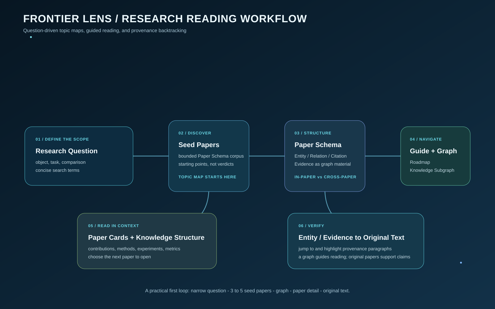
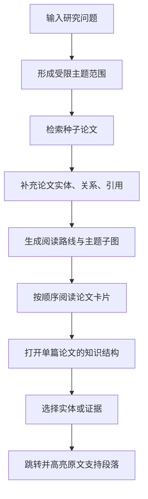

# Frontier Lens 初学者工作流：从研究问题到可回溯的论文阅读



> 适用对象：第一次使用科研文献 Agent、尚不熟悉 Entity（实体）、Relation（关系）、Evidence（证据）或 Paper Schema（论文结构化数据）的研究者。
>
> 本文根据 Frontier Lens 的公开 README 与用户指南入口整理，描述的是其公开说明的产品工作流，不替代该项目的官方文档或实时运行结果。项目地址：[Shannon4Science/sciverse-frontier-lens](https://github.com/Shannon4Science/sciverse-frontier-lens)。

## 1. 先用一句话理解 Frontier Lens

Frontier Lens 是一个**本地运行的科研阅读应用**：你提出一个研究问题，它在一个受限的 Sciverse Paper Schema 在线语料范围内寻找相关论文，把论文及其中已经解析出的实体、关系、引用和证据组织成一个“研究主题图谱”，并引导你沿着一条阅读路径继续阅读。

它不是一个“把所有论文下载到电脑、让模型直接读完后总结”的工具。它的核心思路是：

```text
研究问题
  → 有界检索范围
  → 种子论文
  → 已解析的实体、关系、引用和证据
  → 主题图谱与阅读路线
  → 单篇论文知识结构
  → 回到原文中的支持段落
```

对初学者而言，可以把它理解为“带地图和书签的科研阅读桌”：它先帮你确定从哪些论文起步、这些论文怎样连接、哪些术语/方法/指标反复出现，然后在你需要时回到具体论文段落，而不是只给一串搜索结果。

## 2. 使用前需要认识的六个词

| 术语 | 初学者解释 | 在 Frontier Lens 中的作用 |
| --- | --- | --- |
| 研究问题 | 你真正想弄清楚的自然语言问题，而非单个关键词 | 整个主题探索的入口 |
| 种子论文 | 用来建立初始主题范围的少量高相关论文 | 图谱扩展和阅读路线的起点 |
| Paper Schema | 把论文转成可计算的元数据、实体、关系、证据和引用结构 | 应用的主要数据底座 |
| Entity（实体） | 论文中可被标识的概念，例如方法、任务、数据集、指标、模型或材料名 | 帮助按概念理解论文 |
| Relation（关系） | 两个实体之间已解析的关系，例如“方法使用数据集”“模型提升指标” | 帮助理解论文内部结构 |
| Evidence（证据） | 能支撑某一实体或关系的文本位置/片段 | 让结构化信息能够回溯到原文 |

需要特别注意：Entity、Relation、Citation 和 Evidence 都是结构化数据，不等于你已经完成了科学判断。它们帮助定位和组织阅读；研究质量、实验可比性和最终结论仍需要研究者自己核对。

## 3. Frontier Lens 的三层阅读体验

公开说明将产品组织为三个逐渐深入的层次。理解这三个层次，就理解了它的主要工作流。

| 层次 | 用户看到什么 | 要解决的问题 | 推荐操作 |
| --- | --- | --- | --- |
| 发现图谱 | 研究问题输入、主题图、种子论文 | “这个主题里有哪些值得开始读的论文？” | 输入问题，观察主题范围和种子论文 |
| 研究导读 | Learning Roadmap、Knowledge Subgraph、论文卡片 | “我应按什么顺序读，概念之间怎样相连？” | 沿导读逐项阅读，不急于跳到全部细节 |
| 论文阅读导引 | Paper Reading Guide、Knowledge Structure、Paper Internal Graph、全文面板 | “这篇论文究竟做了什么，证据在哪一段？” | 展开单篇论文并回溯实体/证据的来源 |



## 4. 完整工作流，逐步说明

### 第 0 步：本地启动与连接配置

**你要做什么：** 在本机启动 Python 后端和 React 前端，然后在设置页配置并启用两类连接：Sciverse API 和一个 OpenAI 兼容模型端点。

**为什么两者都需要：**

- Sciverse 负责提供论文结构化数据、已解析实体/关系、引用、证据和按序组织的正文段落；
- 模型负责把自然语言研究问题改写为简洁英文检索词，并基于已经返回的结构化材料生成阅读导读。

**重要的安全边界：** 浏览器只与 Frontier Lens 自己的 `/api/*` 后端通信；Sciverse 密钥和模型密钥留在本地后端/本地配置中。按公开说明，应用不把论文或图谱数据作为本地知识库长期保存；连接配置应当被 Git 忽略，不能截图或提交。

**初学者检查：** 先确认两个连接都已启用。如果缺少任一个连接，探索任务应当停下并提示配置问题，而不是用虚构结果继续演示。

### 第 1 步：把模糊兴趣改写为研究问题

**输入：** 一句能明确研究对象、现象或比较维度的问题。例如：

> “在某一研究方向中，不同方法对模型泛化能力的结论为什么不同？”

**系统处理：** 应用以该问题为起点，将其转换为有限检索范围和更适合论文检索的英文短语。

**你应检查什么：**

1. 问题是否包含研究对象和目标，而不只是“深度学习最新进展”；
2. 是否需要限制任务、时间、场景或方法，否则图谱会过大；
3. 改写后的关键词有没有漏掉你真正关心的术语、缩写或反例。

**输出：** 一个受限主题任务。这里的“受限”很重要：它表示这次探索只针对当前问题和命中的 Paper Schema 语料，而不是声称覆盖所有学术文献。

### 第 2 步：检索种子论文

**输入：** 经处理的研究问题和检索词。

**系统处理：** 从 Sciverse Paper Schema 在线语料中检索少量适合作为起点的论文。公开说明强调，当前可见范围是已经完成 Paper Schema 抽取的 100 万+ AI 会议论文；因此，空结果只能说明“该受限语料中没有命中”，不能证明该领域没有研究。

**输出：** 种子论文及其基础书目信息。

**初学者如何阅读：** 不要把排在前面的论文自动当作“最正确”或“最重要”。更合理的做法是先问：它们各自代表不同方法路线、任务设置还是时间阶段？是否出现了你期待的核心术语？

### 第 3 步：扩展论文结构化信息

**输入：** 种子论文标识符。

**系统处理：** 对这些论文补充数量受限、类别均衡的 Entity 节点与论文内部 Relation；同时读取已经解析的论文间引用、完整参考文献及相关论文建议。论文内部关系与论文间引用会被明确区分。

这一步可以想成给每篇论文做“结构化目录”：

```text
一篇论文
 ├─ 元数据：标题、作者、DOI/arXiv 等
 ├─ Entity：方法、任务、指标、数据集、核心概念……
 ├─ Relation：这些实体在论文内如何关联
 ├─ Citation：它与哪些论文存在引用关系
 └─ Evidence：哪些段落支撑某些实体或关系
```

**输出：** 一个主题子图的原料，而不是未经核实的自由文本总结。

### 第 4 步：生成研究工作流与阅读路线

**输入：** 已返回的结构化论文材料和论文 ID。

**系统处理：** 使用配置的模型生成研究导读和阅读路线。关键限制是：导读模型只接收结构化 Paper Schema 材料，且只能使用 Sciverse 已返回的论文 ID；它不应以“模型似乎知道的论文”补充未知引用。

**输出：** Research Guide / Learning Roadmap，以及相应的 Knowledge Subgraph。

**如何使用阅读路线：**

1. 先读路线中的概念/子问题，不要立刻逐篇精读；
2. 观察系统把哪些论文放在“建立背景”“比较方法”“继续延展”等位置；
3. 对每个关键转折点打开论文卡片，确认排序理由是否符合你的研究目标；
4. 把路线当作可修改的导航建议，而不是文献综述的最终结论。

### 第 5 步：通过论文卡片建立领域脉络

**输入：** 阅读路线中的论文。

**系统处理：** 把扁平搜索结果改为按阅读顺序组织的论文卡片。卡片展示标题、贡献和简要背景，目的是帮助你快速决定下一篇需要读什么。

**初学者的推荐读法：**

- 先比较三到五张卡片，写下它们的共同问题和差别；
- 遇到陌生概念时，不要只看模型描述，点击相关 Entity 查看其在图中的关联；
- 如果某篇论文是关键枢纽，继续进入详情页；如果只是边缘背景，可保留为稍后阅读。

**输出：** 一个由用户主动选择推动的阅读顺序。Frontier Lens 帮助压缩“我该先读什么”的成本，但不替代阅读原论文。

### 第 6 步：从图谱理解“谁与谁相关”

**输入：** 当前主题的论文、实体、关系、引用和推荐关系。

**系统处理：** 在图谱视图中显示不同类型的节点与边：论文节点、Entity 类别、论文内 Relation、已解析的论文间引用，以及带有说明的相关论文建议。

**怎么看图，才不会被图形误导：**

| 图中对象 | 它通常意味着什么 | 不应推断什么 |
| --- | --- | --- |
| 论文—论文引用边 | 一篇论文引用了另一篇，或引用已被解析 | 被引用较多不等于结论必然正确 |
| 论文—实体连接 | 论文提到/使用/讨论该结构化实体 | 该论文一定首次提出该实体 |
| 实体—实体 Relation | 数据中解析出的论文内部关系 | 因果关系已被独立证明 |
| 相关论文建议 | 具有解释的关联候选 | 已形成正式引用关系 |

图谱最适合回答三个问题：哪些概念构成一个簇？哪些论文连接了不同簇？你目前的阅读路线是否只集中在一条方法路线？它不适合单独裁定方法优劣或科学真伪。

### 第 7 步：打开单篇论文，读取知识结构

**输入：** 一张论文卡片、一个图谱论文节点或 `schema_id`。

**系统处理：** 按需加载该论文更完整的 Entity 与 Relation 图谱，并展示结构化概述、方法组件、核心贡献、实验设置、关键发现、指标和文档结构。对于引用，可从已解析引用继续打开关联论文。

**初学者检查清单：**

1. 论文的研究问题、方法和评价指标是否与自己的问题一致？
2. 系统列出的“关键发现”能否在原文中定位？
3. 实验设置/数据集/任务是否与另一篇可比较？
4. 未解析引用是否只是参考文献条目，而非已可继续探索的结构化论文？

### 第 8 步：回溯 Entity 或 Evidence 到原文

**输入：** 你在论文详情页或图谱中选中的 Entity/Evidence。

**系统处理：** 通过 provenance API 分批读取按顺序组织的论文段落，将阅读器跳转到支持该对象的来源位置并高亮。若某个对象缺少锚点，系统会以明确标记的“论文内回退”方式处理；若正式出版版本缺正文段落，可能使用经标题和作者校验、且明确标记的相关版本。

**为什么这是关键一步：** 一张卡片、一个节点或一句导读只是导航。你真正应相信的是可以回到论文位置、连同上下文阅读的内容。必要时还要打开 DOI 或 arXiv 入口，核对图表、补充材料、实验细节和原文限定语。

## 5. 数据与模型的边界

下面的表格尤其适合初学者：它说明“谁负责什么”，并避免把系统能力混成一件事。

| 部件 | 负责什么 | 不负责什么 |
| --- | --- | --- |
| Sciverse Paper Schema | 论文结构化数据、实体、关系、引用、证据和 provenance 段落 | 覆盖全部学术世界或替你判定研究质量 |
| OpenAI 兼容模型 | 问题改写、基于返回结构化材料生成导读 | 擅自增加论文、把模型记忆当引文、替代原文核查 |
| 图谱视图 | 显示拓扑、聚类和关联阅读入口 | 自动证明因果或学术共识 |
| 原文阅读器 | 提供来源定位和高亮 | 自动完成批判性阅读 |
| 本地运行环境 | 保留服务密钥、提供浏览器后端 | 把受限论文数据公开或长期建立本地全文库 |

## 6. 一个可直接模仿的使用示例

假设你刚进入一个陌生的 AI 研究主题，目标是了解“某类模型在不同场景下的泛化能力为何有不同结论”。可按如下节奏使用：

1. 写出问题：对象、任务、比较维度都要明确；
2. 审阅系统形成的检索表达，补上领域缩写或排除无关含义；
3. 在种子论文中挑 3–5 篇，不要一开始打开几十篇；
4. 看知识子图中是否分成不同任务、方法或指标簇；
5. 沿阅读路线先读综述性/背景性节点，再读关键方法节点；
6. 对每个你准备写进笔记的“结论”，点击 Evidence 回到原文；
7. 记录自己的判断：支持条件、反例、仍然不清楚的变量；
8. 用这些未解问题开启下一轮更窄的探索。

这样得到的不是“模型替你写的综述”，而是一条可说明来源的学习路径。

## 7. 新手常见误区

| 误区 | 为什么不对 | 更好的做法 |
| --- | --- | --- |
| 图谱越大越好 | 图过大反而模糊问题边界 | 先缩小研究问题，再逐步扩展 |
| 卡片摘要可以直接引用 | 摘要是导航层，不一定保留全部条件 | 回到 Evidence 和正文定位确认 |
| 图上的关系就是因果 | Relation 是结构化关系，不必然是因果 | 阅读原文方法与限定条件 |
| 没搜到说明没有文献 | 当前语料是受限的 Paper Schema 范围 | 换关键词、用其他数据库交叉检索 |
| 模型导读出现就可信 | 导读受模型和数据范围限制 | 检查它是否只引用返回论文 ID，并回溯证据 |
| 一次任务等于完成调研 | 发现只是第一轮导航 | 把未解问题转化为下一轮研究问题 |

## 8. 何时适合用 Frontier Lens，何时不够

**特别适合：** 快速进入一个主题、建立 AI 论文阅读路线、查看论文内部结构、探索实体/引用网络、从结构化节点回到原文段落。

**需要额外工具或人工补足：** 系统性综述中的复杂纳排标准、跨数据库的完整检索、材料实验条件的单位统一、受限全文的批处理解析、跨文献数值冲突诊断、可证伪 Research Gap 的专家评审。这些正是 CosMatter 进一步强调的受控证据链和人工门禁方向。

## 9. 运行与安全速查

根据公开说明，Frontier Lens 使用 Python 3.11+、Node.js 22+、`uv` 和 `npm`；正常本地使用可从网页“连接设置”配置 Sciverse 和模型连接。运行时，论文和图谱事实来自 Sciverse 在线 API；没有配置或模型调用失败时应停止当前任务并报告错误。

正式开始前，确认以下事项：

- [ ] Sciverse 和模型连接已单独配置并启用；
- [ ] 没有把 Token 写进前端环境变量、URL、截图、日志或 Git；
- [ ] 研究问题范围足够明确；
- [ ] 所有准备写入笔记的关键判断都已回到原文定位；
- [ ] 已认识到当前语料范围和实时数据更新会影响结果。

## 10. 推荐的学习顺序

第一次使用时，建议只完成一轮“小闭环”：一个窄问题、3–5 篇种子论文、一个主题图、两篇论文详情、若干证据回溯。熟悉后再扩大范围。先形成“问题—图谱—论文—原文”的往返习惯，比一开始追求大而全的图谱更重要。

